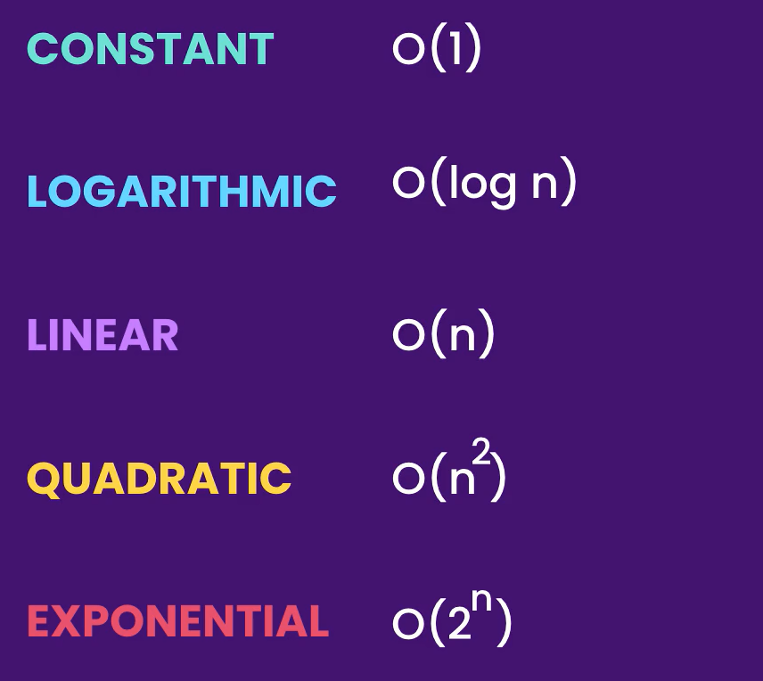
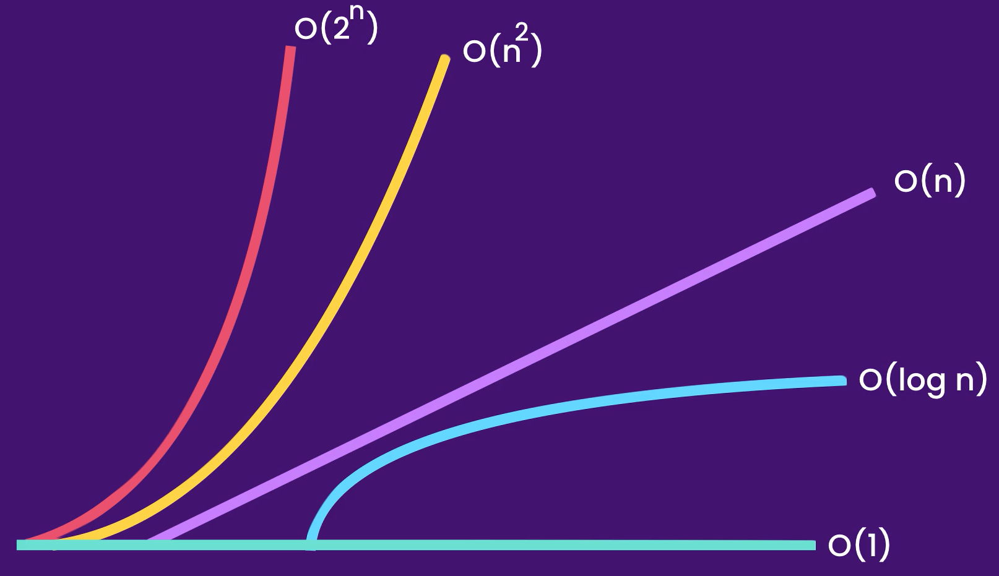
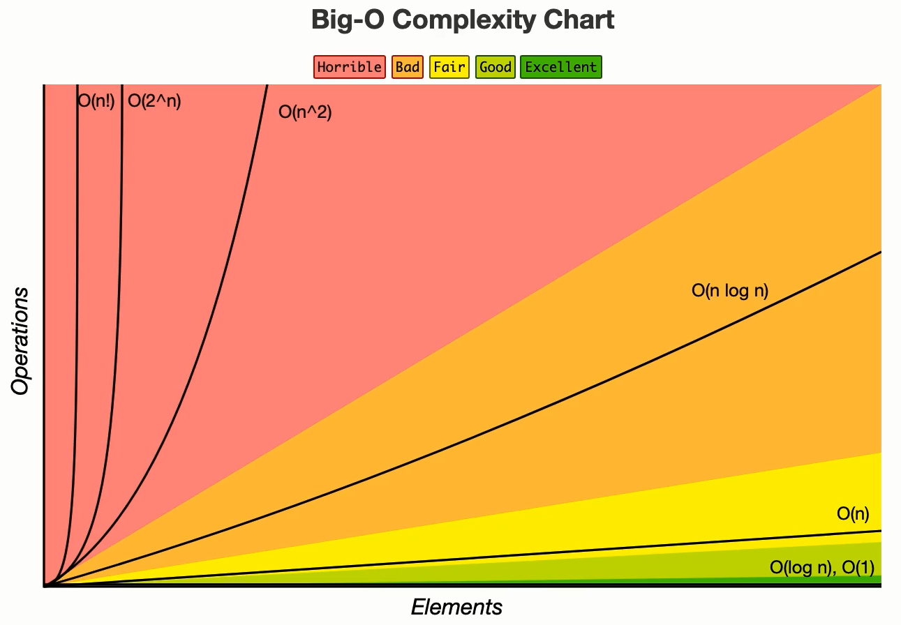

# 🧠 **Big O Notation: Mastering Algorithm Performance**

> _"How fast is your code as the input grows?"_
> That’s what **Big O Notation** helps us answer.

---

<div style="text-align: center">
    
</div>
<div style="text-align: center">
    
</div>
<div style="text-align: center">
    
</div>

---

## 📏 **What Is Big O Notation?**

Big O Notation describes **how an algorithm scales** with input size `n`. It’s not about exact execution time ⏱️ — it’s about **growth rate** 📈 as input increases.

---

## 🔢 **1. O(1) — Constant Time**

- Execution time is **independent of input size**.
- Whether the array has 1 or 1,000,000 elements, the time stays the same.

```cs
public void LogFirstElement(int[] numbers)
{
    Console.WriteLine(numbers[0]);
    Console.WriteLine(numbers[0]);
}
```

✅ Even two operations = still O(1). We **ignore constants** in Big O.

---

## 📶 **2. O(n) — Linear Time**

- Execution time **grows linearly** with input size.
- One operation per element.

### 🔁 Example

```cs
public void LogAllElements(int[] numbers)
{
    foreach (var num in numbers)
        Console.WriteLine(num);
}
```

---

### ⚙️ Combined Examples

```cs
// O(1 + n + 1) → O(n)
public void LogWithExtras(int[] numbers)
{
    Console.WriteLine("Start");
    foreach (var num in numbers)
        Console.WriteLine(num);
    Console.WriteLine("End");
}
```

```cs
// O(n + n) → O(2n) → O(n)
public void DoubleLoop(int[] numbers)
{
    foreach (var num in numbers)
        Console.WriteLine(num);

    foreach (var num in numbers)
        Console.WriteLine(num);
}
```

```cs
// O(m + n)
public void TwoInputs(int[] numbers, string[] names)
{
    foreach (var num in numbers)
        Console.WriteLine(num);

    foreach (var name in names)
        Console.WriteLine(name);
}
```

🧠 Rule: **Different loops over different inputs = additive (O(n + m))**
Same input looped twice = still **linear** (O(n)).

---

## 🪜 **3. O(n²) — Quadratic Time**

- Time grows **exponentially with input size**.
- Most commonly seen in **nested loops**.

### 🫧 Bubble Sort Example

```cs
public void BubbleSort(int[] array)
{
    for (int i = 0; i < array.Length - 1; i++)
    {
        for (int j = 0; j < array.Length - i - 1; j++)
        {
            if (array[j] > array[j + 1])
            {
                // Swap
                int temp = array[j];
                array[j] = array[j + 1];
                array[j + 1] = temp;
            }
        }
    }
}
```

🔁 Two nested loops → O(n²)

---

## 📉 **4. O(log n) — Logarithmic Time**

- Input size increases, but **steps grow slowly**.
- Most famously used in **binary search** 🧭.

### 🔍 Binary Search Example

```cs
public int BinarySearch(int[] sortedArray, int target)
{
    int left = 0;
    int right = sortedArray.Length - 1;

    while (left <= right)
    {
        int mid = left + (right - left) / 2;

        if (sortedArray[mid] == target)
            return mid;

        if (sortedArray[mid] < target)
            left = mid + 1;
        else
            right = mid - 1;
    }

    return -1;
}
```

➡️ Each step cuts the input in half → **log base 2**

---

## 🪜🔁 **5. O(n log n) — Linearithmic Time**

- **Divide-and-conquer** meets **linear processing**.
- Found in algorithms like **Merge Sort**, **Quick Sort**, and some tree operations.

🧠 Intuition:

- You divide things up (`log n`)
- Then merge or combine results (`n`)

> Merge Sort = O(n log n)

---

## 💥 **6. O(2ⁿ) — Exponential Time**

- Time **doubles with every new element**.
- Common in naive recursive problems like **Fibonacci** or **brute-force subsets**.

### 🧨 Example

```cs
public int Fibonacci(int n)
{
    if (n <= 1)
        return n;

    return Fibonacci(n - 1) + Fibonacci(n - 2);
}
```

➡️ Each call creates **2 more calls** → very inefficient
Use **memoization** to reduce to O(n)

---

## 🔂 Common Time Complexities Chart

| Big O      | Description                | Example                     |
| ---------- | -------------------------- | --------------------------- |
| O(1)       | Constant                   | Accessing an array element  |
| O(log n)   | Logarithmic                | Binary search               |
| O(n)       | Linear                     | Simple for-loop             |
| O(n log n) | Linearithmic               | Merge Sort                  |
| O(n²)      | Quadratic                  | Nested loops                |
| O(2ⁿ)      | Exponential                | Naive recursion (Fibonacci) |
| O(n!)      | Factorial (extremely slow) | Traveling Salesman problem  |

---

## 🧠 Final Tips

- **Drop constants** → O(2n) becomes O(n)
- **Nested loops** often = O(n²)
- **Separate loops over different inputs?** → Add (O(m + n))
- **Recursive trees?** → Analyze depth × work per level
