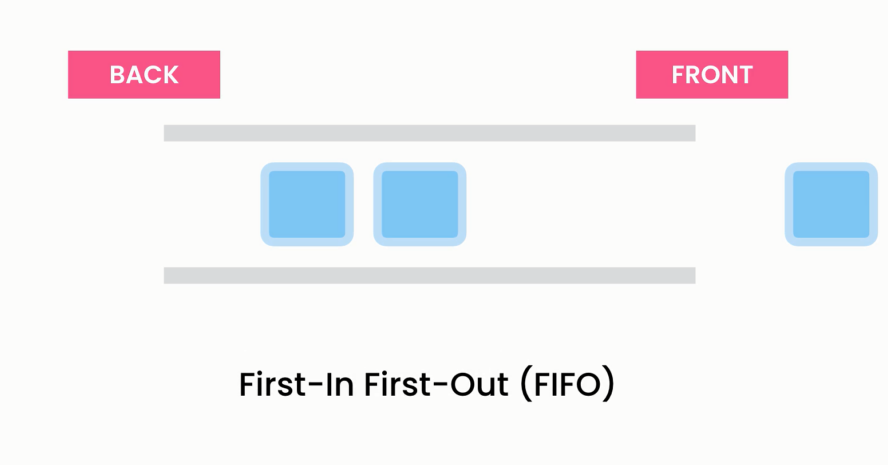
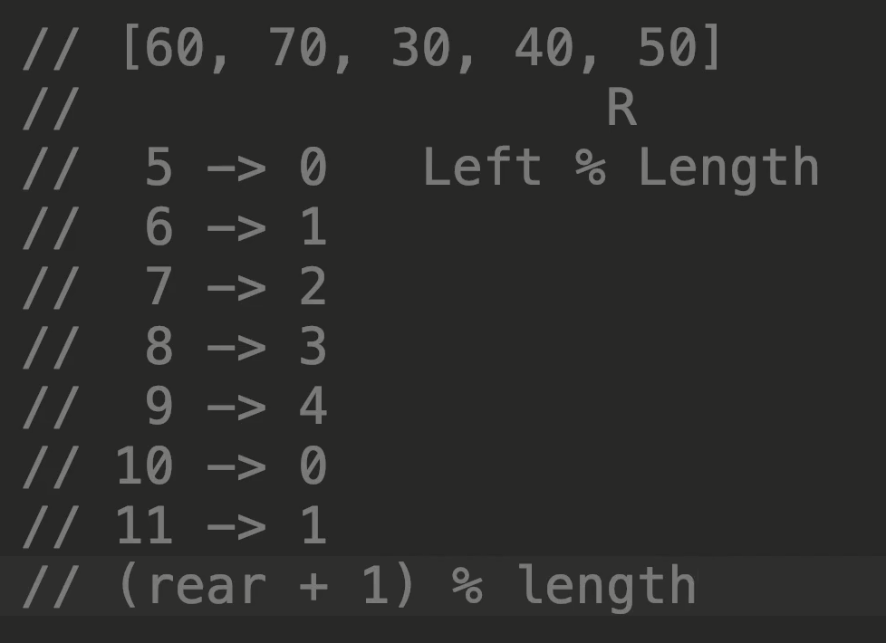

# 🧾 **Queue Data Structure: First In, First Out (FIFO)**

> A **Queue** is a linear data structure that follows the **First In, First Out (FIFO)** principle.
> Like a real-life **waiting line**, the first person in is the first person out!

---

<div style="text-align: center">
    
</div>

---

## 🧠 Real-World Analogy

- 🚌 Bus line — First person to arrive boards first
- 🖨️ Print jobs in a printer queue
- ⏳ Task scheduling in operating systems

---

## ⚙️ Key Operations & Time Complexities

| Operation    | Description                            | Time Complexity |
| ------------ | -------------------------------------- | --------------- |
| `Enqueue(x)` | Add element at rear (tail)             | O(1)            |
| `Dequeue()`  | Remove element from front (head)       | O(1)            |
| `Peek()`     | View front element without removing it | O(1)            |
| `IsEmpty`    | Check if queue is empty                | O(1)            |
| `IsFull`     | (Only for fixed-size arrays)           | O(1)            |

📌 In `Queue<T>` from .NET — resizing and wrap-around are handled automatically.

---

## 🧬 Characteristics

| Feature        | Description                                                            |
| -------------- | ---------------------------------------------------------------------- |
| 📥 **Enqueue** | Add element at the rear (`queue.Enqueue(x)`)                           |
| 📤 **Dequeue** | Remove element from the front (`queue.Dequeue()`)                      |
| 🔍 **Peek**    | See front item without removing                                        |
| 🔁 **Order**   | Maintains insertion order — FIFO                                       |
| 💾 **Memory**  | `Queue<T>` is a **heap-allocated object**, variable lives on **stack** |

---

## 📦 .NET Example

```csharp
Queue<int> queue = new Queue<int>();

queue.Enqueue(10);
queue.Enqueue(20);
queue.Enqueue(30);

int firstOut = queue.Dequeue(); // 10
int peeked = queue.Peek();      // 20

Console.WriteLine("Removed: " + firstOut);  // 10
Console.WriteLine("Next in line: " + peeked);  // 20
```

---

## 🔁 Reverse a Queue Using a Stack

```csharp
public static Queue<T> Reverse<T>(Queue<T> queue)
{
    var stack = new Stack<T>();

    while (queue.Count > 0)
        stack.Push(queue.Dequeue());

    while (stack.Count > 0)
        queue.Enqueue(stack.Pop());

    return queue;
}
```

🧠 Stack reverses the order — LIFO over FIFO = reversed output

---

## 🏗 Custom Implementation — Circular Array Queue

> Uses fixed-size array with wrap-around logic. Avoids shifting!

---

<div style="text-align: center">
    
</div>

---

### 📊 Circular Array Visual

```ini
Front → [20] [30] [  ] [  ] [10] ← Rear
```

- When end is reached, rear wraps to 0
- Saves space by reusing freed-up slots

---

### 🧰 Circular Queue Class

```csharp
public class CircularQueue<T>
{
    private T[] _array;
    private int _front;
    private int _rear;
    private int _count;

    public CircularQueue(int capacity)
    {
        _array = new T[capacity];
        _front = 0;
        _rear = 0;
        _count = 0;
    }

    public void Enqueue(T item)
    {
        if (_count == _array.Length)
            throw new InvalidOperationException("Queue is full");

        _array[_rear] = item;
        _rear = (_rear + 1) % _array.Length;
        _count++;
    }

    public T Dequeue()
    {
        if (IsEmpty())
            throw new InvalidOperationException("Queue is empty");

        var item = _array[_front];
        _front = (_front + 1) % _array.Length;
        _count--;
        return item;
    }

    public bool IsEmpty() => _count == 0;
    public bool IsFull() => _count == _array.Length;
    public T Peek() => _array[_front];
}
```

---

## 🔁 Queue Using Two Stacks

Used in interview problems like implementing a queue with two stacks.

```csharp
public class QueueWithStacks<T>
{
    private Stack<T> _in = new Stack<T>();
    private Stack<T> _out = new Stack<T>();

    public void Enqueue(T item) => _in.Push(item);

    public T Dequeue()
    {
        if (_out.Count == 0)
            while (_in.Count > 0)
                _out.Push(_in.Pop());

        if (_out.Count == 0)
            throw new InvalidOperationException("Queue is empty");

        return _out.Pop();
    }

    public T Peek()
    {
        if (_out.Count == 0)
            while (_in.Count > 0)
                _out.Push(_in.Pop());

        return _out.Peek();
    }

    public bool IsEmpty() => _in.Count == 0 && _out.Count == 0;
}
```

📌 **Time Complexity:**

- Amortized O(1) for `Enqueue` and `Dequeue`

---

## 🚦 Priority Queue (Mentioned Briefly)

> A **priority queue** returns elements based on **priority**, not FIFO.

- Use: `SortedList`, `SortedSet`, or `MinHeap` (`PriorityQueue<T>` in .NET 6+)
- Insert: O(log n)
- Remove Min/Max: O(log n)

---

## ✅ Summary Table

| Feature      | Queue                         | Stack                       | Priority Queue                    |
| ------------ | ----------------------------- | --------------------------- | --------------------------------- |
| Order        | FIFO                          | LIFO                        | By priority                       |
| Insert       | Enqueue → Rear                | Push → Top                  | Add → Sorted                      |
| Remove       | Dequeue → Front               | Pop → Top                   | Remove highest/lowest priority    |
| Time Enq/Deq | O(1)                          | O(1)                        | O(log n)                          |
| Use Cases    | BFS, job queue, OS schedulers | Undo, backtracking, parsing | Heaps, shortest paths, scheduling |

---

## 🧠 When to Use a Queue?

| Scenario                               | Use Queue?            |
| -------------------------------------- | --------------------- |
| Tasks must be handled in arrival order | ✅ Yes                |
| Require constant-time dequeue          | ✅ Yes                |
| Need to reverse order later            | ❌ Use Stack          |
| Priority matters                       | ❌ Use Priority Queue |
