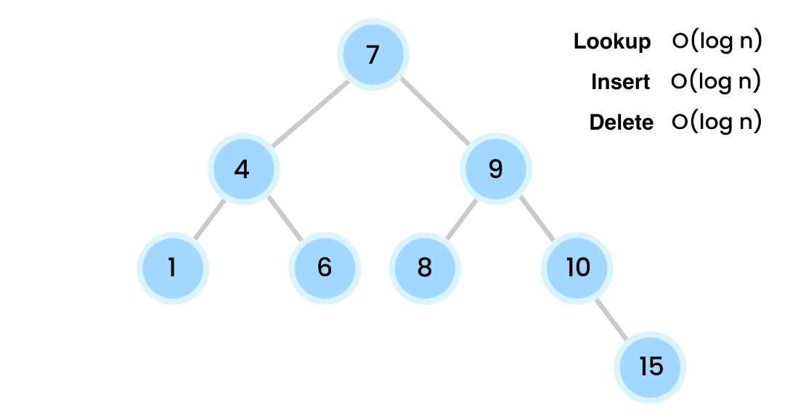

# 🌳 What Is a Tree (in Programming)?

> A **tree** is a special data structure that looks like an **upside-down tree**:
> it starts from one main **root**, and **branches out** into nodes (like branches and leaves).

Think of:

- 📁 A file system (`C:\Users\You\Documents`)
- 👪 A family tree (parent → children)
- 📄 An HTML page (`<html>` → `<body>` → `<div>`)

---

<div style="text-align: center;">
    
</div>

---

## 👶 Tree Vocabulary

<div style="display:flex; justify-content: center; align-items: center;">

<div >

```ini
        A         ← Root
       / \
      B   C       ← Children of A
     / \   \
    D   E   F     ← Leaf nodes (no children)
```

</div>

</div>

| Term        | Meaning                                      |
| ----------- | -------------------------------------------- |
| **Node**    | A single element in the tree                 |
| **Root**    | The top node (starting point of the tree)    |
| **Child**   | A node directly connected below another node |
| **Parent**  | A node that has children                     |
| **Leaf**    | A node with **no children**                  |
| **Edge**    | The line (connection) between two nodes      |
| **Subtree** | Any branch below a node                      |
| **Height**  | Distance from root to the deepest leaf       |

---

## 🔍 Real-Life Analogy: File Explorer

```ini
C:\
├── Users
│   └── You
│       ├── Documents
│       └── Pictures
└── Program Files
```

- `C:\` is the **root**
- `Users`, `Program Files` are **children**
- `Documents` is a **leaf**
- This is a **tree**!

---

## 🧠 Why Trees Are Special

- ✅ No loops (they’re **acyclic**)
- ✅ Exactly **one path** between any two nodes
- ✅ Perfect for **hierarchical** data
- ✅ Used in **searching**, **sorting**, **compilers**, **databases**, **AI**, etc.

---

## 🧱 Types of Trees

| Type                         | Description                                 | Example Use                |
| ---------------------------- | ------------------------------------------- | -------------------------- |
| **Binary Tree**              | Each node has **at most 2 children**        | Expression trees, games    |
| **Binary Search Tree (BST)** | Left < Root < Right                         | Fast lookup, sorted data   |
| **Balanced Tree**            | Height is kept small (e.g., AVL, Red-Black) | Databases, Filesystems     |
| **N-ary Tree**               | Each node can have many children            | HTML DOM, org charts       |
| **Trie (Prefix Tree)**       | Stores strings as paths through tree        | Autocomplete, dictionaries |

---

## 🔁 Tree Traversal

> How do you walk through a tree?

### ✅ Depth-First Search (DFS)

| Type      | Order                |
| --------- | -------------------- |
| Preorder  | Visit → Left → Right |
| Inorder   | Left → Visit → Right |
| Postorder | Left → Right → Visit |

### ✅ Breadth-First Search (BFS)

- Also called **Level Order**
- Go level by level (top → down)

---

### 🧪 DFS Example: Preorder

```ini
        A
       / \
      B   C
     / \
    D   E

Preorder (Root → Left → Right): A, B, D, E, C
```

---

## 🧮 Tree in Code (C# Example)

```csharp
public class TreeNode
{
    public int val;
    public TreeNode left;
    public TreeNode right;

    public TreeNode(int x) { val = x; }
}
```

---

## 📦 Tree Use Cases in Real Life

| Scenario          | Tree Type          |
| ----------------- | ------------------ |
| HTML Structure    | N-ary Tree         |
| Folder Explorer   | N-ary Tree         |
| Game AI           | Minimax Trees      |
| Autocomplete      | Trie               |
| Dictionary Lookup | Binary Search Tree |
| Family Trees      | General Tree       |

---

## 🏁 Summary

- A **Tree** is a hierarchical data structure made of nodes.
- Starts from a **root**, branches out to **children**, ends in **leaves**.
- Used everywhere from **file systems** to **webpages** to **AI**.
- You can **traverse** them using DFS or BFS depending on the problem.
- There are many **special types** like BST, AVL, Tries, etc.
