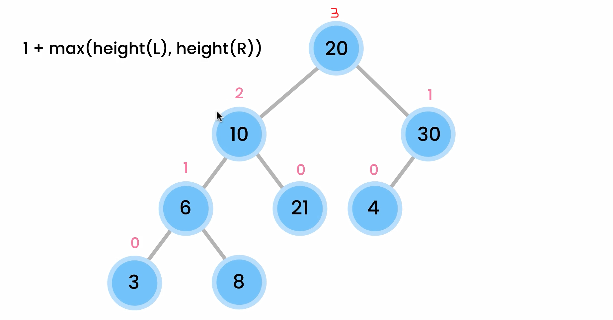

# 🌳 Tree Depth vs Height – Explained Simply

## 🌲 Visual Tree

<div style="display:flex; justify-content: center; align-items: center;">

<div>

```ini
        A        <-- Depth 0, Height 3
       / \
      B   C      <-- Depth 1
     / \   \
    D   E   F    <-- Depth 2
               \
                G  <-- Depth 3, Height 0 (leaf)
```

```ini
| Node | Depth | Height |
| ---- | ----- | ------ |
| A    | 0     | 3      |
| B    | 1     | 2      |
| D    | 2     | 0      |
| F    | 2     | 1      |
| G    | 3     | 0      |
```

</div>
</div>

---

<div style="text-align: center;">
    
</div>

---

## 📘 Definitions

| Term               | Definition                                      |
| ------------------ | ----------------------------------------------- |
| **Depth**          | Distance from the **root to the node**          |
| **Height**         | Distance from a **node to the deepest leaf**    |
| **Height of Tree** | Height of the **root node**                     |
| **Depth of Tree**  | Depth of the **deepest leaf** (same as height!) |

---

## 🧠 Intuition

Imagine the tree is a building:

- 📦 **Depth**: How far you go **down** from the top (floor number)
- 📦 **Height**: How far you can go **up** from a node to the top floor (number of floors above it)

---

## ✅ Implementation in `C#`

### 🔢 1. Height of a Tree (Recursive)

> The height of a node = 1 + **max height of its children**

```csharp
int Height(TreeNode? node)
{
    if (node == null)
        return -1; // OR return 0 if you define leaf height = 1

    int leftHeight = Height(node.left);
    int rightHeight = Height(node.right);

    return 1 + Math.Max(leftHeight, rightHeight);
}
```

---

### 🔢 2. Depth of a Node

> Depth = number of edges from **root to the node**

We’ll search for the node recursively and count steps:

```csharp
int Depth(TreeNode? root, TreeNode target)
{
    if (root == null) return -1;
    if (root == target) return 0;

    int left = Depth(root.left, target);
    if (left != -1) return left + 1;

    int right = Depth(root.right, target);
    if (right != -1) return right + 1;

    return -1; // Not found
}
```

---

## 📏 Formulas

| Task              | Formula / Logic                                  |
| ----------------- | ------------------------------------------------ |
| Tree Height       | `max(leftSubtreeHeight, rightSubtreeHeight) + 1` |
| Tree Depth        | Count edges from root to node                    |
| Max Depth of Tree | Same as Height of Root node                      |

---

## 🧠 Why This Matters

| Problem                    | Needs Height or Depth? |
| -------------------------- | ---------------------- |
| Balanced tree check        | Height                 |
| Binary tree diameter       | Height                 |
| Root-to-leaf path problems | Depth + Backtracking   |
| Level order / BFS          | Depth (by levels)      |

---

## 🧪 Example Usage

```csharp
TreeNode root = new TreeNode(1);
root.left = new TreeNode(2);
root.right = new TreeNode(3);
root.left.left = new TreeNode(4);

int height = Height(root);  // Output: 2
int depthOf4 = Depth(root, root.left.left);  // Output: 2
```

---

## 🧩 Interview Tip

- **"Max depth of binary tree"** on LeetCode = compute **height** of root
- Base case returns `-1` if height of leaf is defined as 0
- Base case returns `0` if height of leaf is defined as 1 (your choice — just be consistent)

---

## 🧭 Summary Table

| Concept                 | What It Measures              | Example                         |
| ----------------------- | ----------------------------- | ------------------------------- |
| Depth                   | Root → Node (downward steps)  | Like building floor from lobby  |
| Height                  | Node → Farthest Leaf (upward) | Like tallest tower from a floor |
| Max Depth = Tree Height | Applies to root node          | DFS-based                       |
