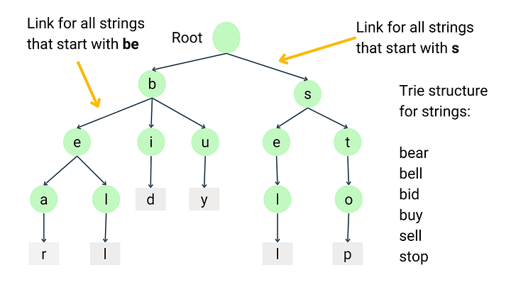
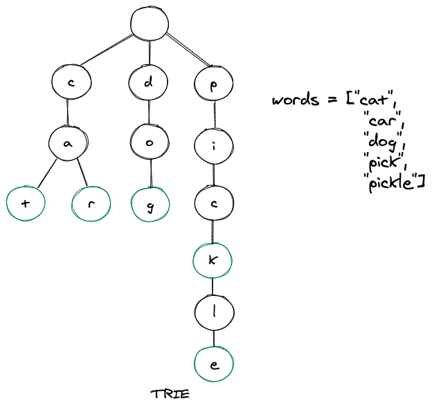

# 🌲 What is a Trie?

A **Trie** (pronounced _“try”_) is a **tree-like data structure** used to store a **collection of strings**, usually words. It's perfect for **prefix-based searching**.

---

<div style="text-align: center;">
    
</div>

---

## 🧠 Real-world Analogy

Think of a Trie like a **dictionary search bar**:

- You type **"ap"**, and it instantly shows "apple", "apricot", "apply", etc.
- It works by following the letters you typed and exploring all the words starting with that prefix.

That’s exactly what a **Trie** is for.

---

## 📦 Key Trie Properties

| Property  | Value                                    |
| --------- | ---------------------------------------- |
| Data Type | Tree of characters                       |
| Root      | Empty node                               |
| Children  | One for each letter (usually 26 for a–z) |
| Word ends | Marked by `isWord = true`                |

---

## 👷 Structure of a Trie Node

```csharp
public class TrieNode
{
    public Dictionary<char, TrieNode> Children = new();
    public bool IsWord = false;
}
```

- `Children`: each key is a character (like 'a', 'b', ...)
- `IsWord`: true when a word ends at this node

---

## 🌳 Visual Example: Insert “apple”, “app”, “bat”

```ini
ROOT
 ├── a
 │   └── p
 │       └── p (isWord: true)
 │           └── l
 │               └── e (isWord: true)
 └── b
     └── a
         └── t (isWord: true)
```

---

<div style="text-align: center;">
    
</div>

---

## ✅ Supported Operations

| Operation            | Purpose                              | Time Complexity |
| -------------------- | ------------------------------------ | --------------- |
| `Insert(word)`       | Add word to the Trie                 | O(L)            |
| `Search(word)`       | Check if exact word exists           | O(L)            |
| `StartsWith(prefix)` | Check if any word starts with prefix | O(L)            |

> L = length of the word or prefix

---

## ✅ Full C# Trie Implementation

```csharp
public class TrieNode
{
    public Dictionary<char, TrieNode> Children = new();
    public bool IsWord = false;
}

public class Trie
{
    private readonly TrieNode root = new();

    public void Insert(string word)
    {
        TrieNode node = root;
        foreach (char ch in word)
        {
            if (!node.Children.ContainsKey(ch))
                node.Children[ch] = new TrieNode();

            node = node.Children[ch];
        }
        node.IsWord = true;
    }

    public bool Search(string word)
    {
        TrieNode? node = GetNode(word);
        return node != null && node.IsWord;
    }

    public bool StartsWith(string prefix)
    {
        return GetNode(prefix) != null;
    }

    private TrieNode? GetNode(string str)
    {
        TrieNode node = root;
        foreach (char ch in str)
        {
            if (!node.Children.TryGetValue(ch, out node))
                return null;
        }
        return node;
    }
}
```

---

## 🧪 Example Usage

```csharp
var trie = new Trie();
trie.Insert("apple");
trie.Insert("app");

Console.WriteLine(trie.Search("app"));      // true
Console.WriteLine(trie.Search("appl"));     // false
Console.WriteLine(trie.StartsWith("ap"));   // true
Console.WriteLine(trie.StartsWith("bat"));  // false

trie.Insert("bat");
Console.WriteLine(trie.Search("bat"));      // true
```

---

## 📊 Tries vs HashSet vs Binary Search Tree

| Feature          | Trie                    | HashSet / HashMap | BST            |
| ---------------- | ----------------------- | ----------------- | -------------- |
| Prefix search    | ✅ Fast (O(L))          | ❌ Not supported  | ❌ Inefficient |
| Full word lookup | ✅ O(L)                 | ✅ O(1) avg       | ✅ O(log n)    |
| Space usage      | ❌ High (many pointers) | ✅ Compact        | ✅ Compact     |
| Case-sensitive?  | ✅ (if coded)           | ✅                | ✅             |

---

## ✅ When to Use a Trie

- **Autocomplete systems**
- **Spell-checkers**
- **Search suggestions**
- **Prefix filtering**
- **Word games (e.g. Boggle, Scrabble solver)**
