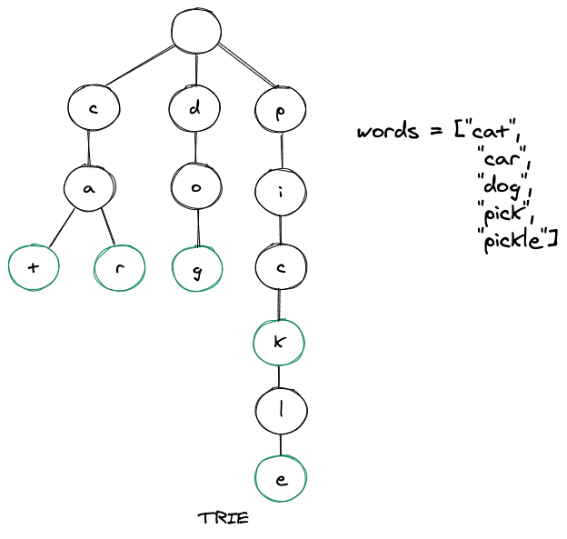

# 🌲 Trie (Prefix Tree) – C# Implementation

<div style="text-align: center;">
    
</div>

---

## 🔧 TrieNode Class

```csharp
public class TrieNode
{
    public Dictionary<char, TrieNode> Children { get; set; }
    public bool IsWord { get; set; }

    public TrieNode()
    {
        Children = new Dictionary<char, TrieNode>();
        IsWord = false;
    }
}
```

- `Children`: maps each character to the next TrieNode.
- `IsWord`: marks whether this node is the **end of a valid word**.

---

## 🧠 Trie Class

```csharp
public class Trie
{
    private readonly TrieNode root;

    public Trie()
    {
        root = new TrieNode();
    }

    // Inserts a word into the Trie
    public void Insert(string word)
    {
        TrieNode current = root;

        foreach (char ch in word)
        {
            if (!current.Children.ContainsKey(ch))
            {
                current.Children[ch] = new TrieNode();
            }

            current = current.Children[ch];
        }

        current.IsWord = true;
    }

    // Returns true if the exact word exists
    public bool Search(string word)
    {
        TrieNode? node = FindNode(word);
        return node != null && node.IsWord;
    }

    // Returns true if any word starts with the given prefix
    public bool StartsWith(string prefix)
    {
        return FindNode(prefix) != null;
    }

    // Helper method to follow the path of characters
    private TrieNode? FindNode(string str)
    {
        TrieNode current = root;

        foreach (char ch in str)
        {
            if (!current.Children.ContainsKey(ch))
                return null;

            current = current.Children[ch];
        }

        return current;
    }
}
```

---

## ✅ Example Usage

```csharp
public class Program
{
    public static void Main()
    {
        Trie trie = new Trie();

        trie.Insert("apple");
        trie.Insert("app");
        trie.Insert("bat");

        Console.WriteLine(trie.Search("apple"));   // true
        Console.WriteLine(trie.Search("app"));     // true
        Console.WriteLine(trie.Search("appl"));    // false
        Console.WriteLine(trie.StartsWith("ap"));  // true
        Console.WriteLine(trie.StartsWith("ba"));  // true
        Console.WriteLine(trie.StartsWith("cat")); // false
    }
}
```

---

## 🧪 Output

```ini
True
True
False
True
True
False
```
