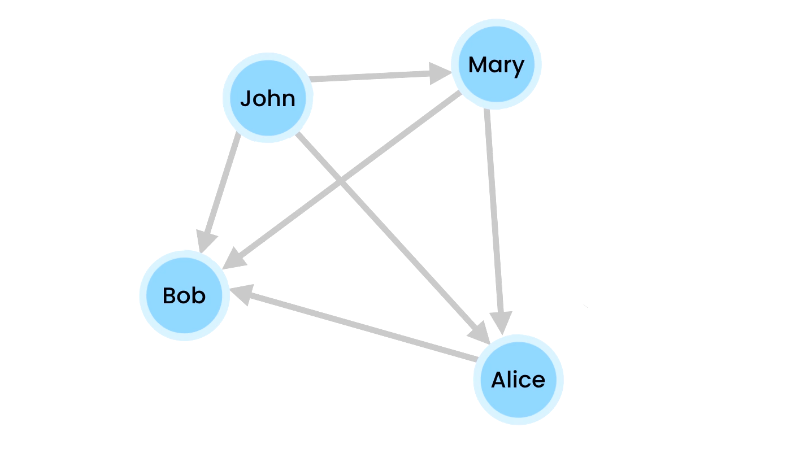
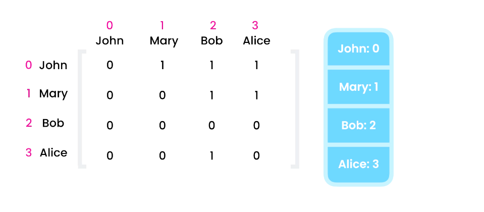
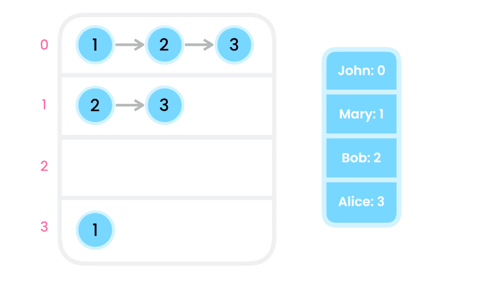
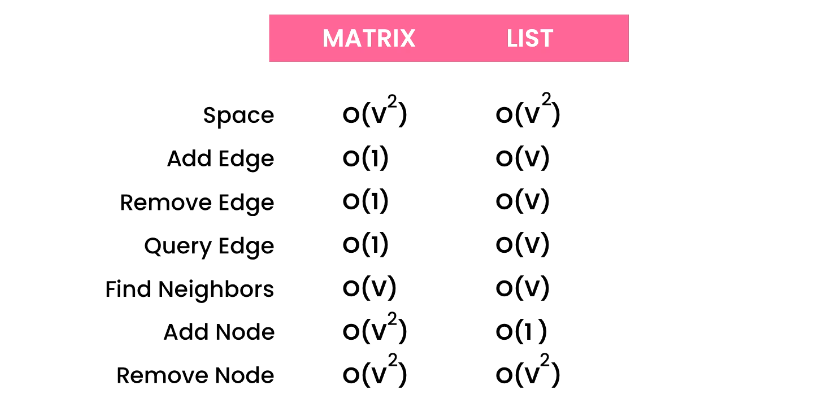

# 🌐 What is a Graph in DSA?

A **Graph** is a collection of **nodes** (called **vertices**) and **connections** between them (called **edges**).

> Think of it like a **network** of cities (nodes) and roads (edges) between them.

---

<div style="text-align: center;">
    
</div>

---

## 📘 Basic Terms

| Term          | Meaning                               |
| ------------- | ------------------------------------- |
| **Vertex**    | A node in the graph                   |
| **Edge**      | A connection between two vertices     |
| **Graph**     | A set of vertices and their edges     |
| **Adjacency** | Vertices that are connected by edges  |
| **Degree**    | Number of edges connected to a vertex |

---

## 🧱 Types of Graphs

### 🔄 1. **Directed vs Undirected**

- **Directed**: edges have a direction → (A ➝ B)
- **Undirected**: edges go both ways → (A — B)

### 🔢 2. **Weighted vs Unweighted**

- **Weighted**: edges have a cost or distance
- **Unweighted**: all edges are equal

### 🔁 3. **Cyclic vs Acyclic**

- **Cyclic**: can form a loop
- **Acyclic**: no loops (like a tree)

### 💫 4. **Connected vs Disconnected**

- **Connected**: all nodes reachable
- **Disconnected**: some isolated nodes

---

## 💡 Real-Life Examples of Graphs

| Scenario              | Nodes    | Edges                       |
| --------------------- | -------- | --------------------------- |
| Maps / GPS Navigation | Cities   | Roads                       |
| Social Networks       | Users    | Friend/follow relationships |
| Web Page Links        | Websites | Hyperlinks                  |
| Airline Routes        | Airports | Flight connections          |

---

## 🧱 How Do We Represent Graphs?

### 1. **Adjacency Matrix**

> A 2D array where `matrix[i][j] = 1` means there's an edge from node `i` to node `j`.

---

<div style="text-align: center;">
    
</div>

---

```text
Nodes: 0, 1, 2

Matrix:

   0 1 2
0 [0 1 0]
1 [0 0 1]
2 [1 0 0]
```

✅ Fast lookup
❌ Wastes space if graph is sparse

---

### 2. **Adjacency List** ✅ Most Common

> A dictionary (or array) where each node maps to a list of its neighbors.

---

<div style="text-align: center;">
    
</div>

---

```csharp
Dictionary<int, List<int>> graph = new()
{
    [0] = new List<int> { 1 },
    [1] = new List<int> { 2 },
    [2] = new List<int> { 0 }
};
```

✅ Space-efficient  
✅ Easy to iterate neighbors  
✅ Used in most interview problems

---

### Adjacency Matrix 🆚 Adjacency List

<div style="text-align: center;">
    
</div>

---

## 🎯 What Can You Do with Graphs?

| Algorithm        | Purpose                                     |
| ---------------- | ------------------------------------------- |
| DFS / BFS        | Explore nodes, find paths                   |
| Dijkstra's       | Shortest path in weighted graphs            |
| Bellman-Ford     | Shortest path (can handle negative weights) |
| Floyd-Warshall   | All pairs shortest path                     |
| Kruskal / Prim   | Minimum spanning tree                       |
| Topological Sort | Order tasks without cycles (DAGs)           |
| Union-Find       | Detect cycles / connected components        |

---

## 🔄 Traversal – BFS vs DFS

### 🔍 BFS (Breadth-First Search)

- Use a **queue**
- Visit neighbors **level by level**

### 🌳 DFS (Depth-First Search)

- Use **recursion** or **stack**
- Go deep down a path before backtracking

---

## 🧠 Sample Interview Graph Problem

> “Given a graph and a start node, find if there’s a path to the target node.”

✅ You’d use **BFS or DFS**  
✅ Use an **Adjacency List** to represent the graph  
✅ Track **visited nodes** to avoid infinite loops

---

## ✅ Summary Table

| Concept        | Quick Summary                         |
| -------------- | ------------------------------------- |
| Graph          | Nodes + Edges                         |
| Directed       | One-way edges (A ➝ B)                 |
| Undirected     | Two-way edges (A — B)                 |
| Weighted       | Edges have cost/weight                |
| Adjacency List | Most common, efficient representation |
| BFS            | Level order (queue)                   |
| DFS            | Depth-first (stack/recursion)         |
| Used in        | Maps, networks, compilers, puzzles    |
