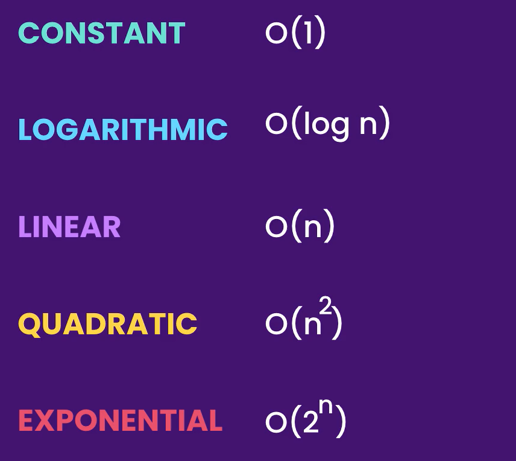
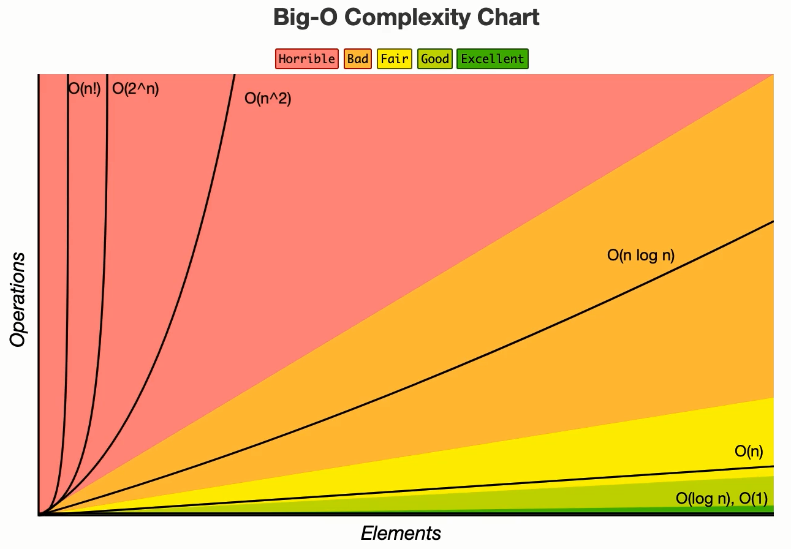

# Big O Notation

Big O Notation is a way to describe the performance of an algorithm




## 1. O(1)

- Constant time complexity. The algorithm's performance is independent of the size of the input.

```cs
public void log(int[] numbers){
    console.log(numbers[0])
    console.log(numbers[0])
}
```

- The time complexity of this code is O(1), not O(2). The reason is that the number of operations (in this case, the number of Console.WriteLine statements) remains constant regardless of the size of the input array.
- the above code is o1 because that operation doesn't depend on the size of an inputs(array).

## 2. O(n)

- Linear time complexity. The algorithm's performance grows linearly with the size of the input.

### Examples

```cs
//On(n)
public void log(int[] numbers){
   for (int i = 0; i < numbers.length; i ++){
    console.log(numbers[0])
   }
}
```

```cs
//O(2+n) => O(n)
public void log(int[] numbers){
   // o(1)
   console.log(numbers[0])
   // o(n)
   for (int i = 0; i < numbers.length; i ++){
    console.log(numbers[0])
   }
   // o(1)
   console.log(numbers[0])

}
```

```cs
//O(2n) => O(n)
public void log(int[] numbers){
    // o(n)
    for (int i = 0; i < numbers.length; i ++){
    console.log(numbers[0])
    }
    // o(n)
    for (int i = 0; i < numbers.length; i ++){
    console.log(numbers[0])
    }
}
```

```cs
//O(m+n) => O(n)
public void log(int[] numbers, string[] names){
    // o(n)
    for (int i = 0; i < numbers.length; i ++){
    console.log(numbers[0])
    }

    // o(m)
    for (int i = 0; i < names.length; i ++){
    console.log(numbers[0])
    }
}
```

## 3. O(n^2)

- Quadratic time complexity. The algorithm's performance grows quadratically with the size of the input, often seen in nested loops.

### 3.Examples

```cs
public static void BubbleSort(int[] array)
    {
        int n = array.Length;

        for (int i = 0; i < n - 1; i++)
        {
            for (int j = 0; j < n - i - 1; j++)
            {
                if (array[j] > array[j + 1])
                {
                    // Swap array[j] and array[j + 1]
                    int temp = array[j];
                    array[j] = array[j + 1];
                    array[j + 1] = temp;
                }
            }
        }
    }
```

## 4. O(log n)

- Logarithmic time complexity. The algorithm's performance grows logarithmically with the size of the input.

### 4.Examples

```cs
    public static int BinarySearch(int[] sortedArray, int target)
    {
        int left = 0;
        int right = sortedArray.Length - 1;

        while (left <= right)
        {
            int mid = left + (right - left) / 2;

            if (sortedArray[mid] == target)
            {
                return mid; // Target found
            }
            else if (sortedArray[mid] < target)
            {
                left = mid + 1; // Search the right half
            }
            else
            {
                right = mid - 1; // Search the left half
            }
        }

        return -1; // Target not found
    }
```

## 5.O(n log n)

- Linearithmic time complexity. Common in algorithms like merge sort, where each step requires O(n) operations.

## 6. O(2^n)

- Exponential time complexity. The algorithm's performance grows exponentially with the size of the input, often seen in recursive algorithms without memoization.
