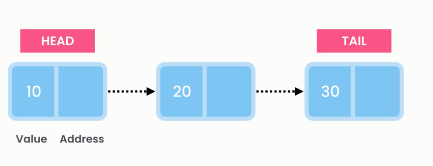
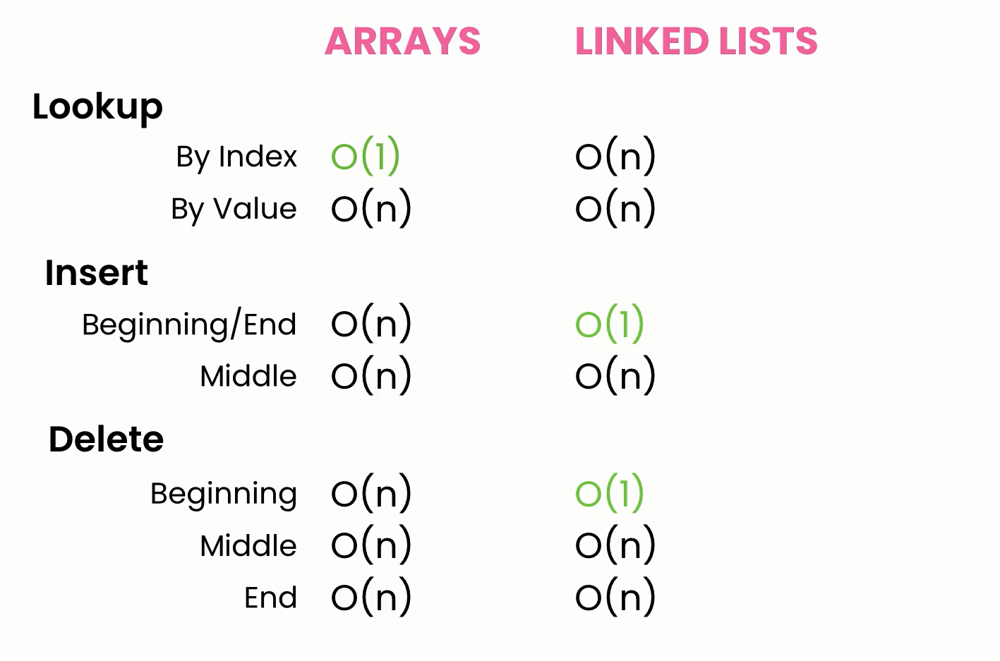
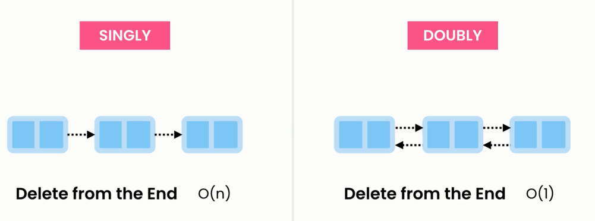

# 🔗 **Linked List Data Structure: Deep Dive**

> A **Linked List** is a linear data structure where each element (called a **node**) points to the **next** node — like a **chain of boxes** 🔗.

---

<div style="text-align: center">
    
</div>

---

## 📦 Memory Behavior: Heap vs Stack

- A **linked list** lives in the **heap**, even if it's declared as a local variable.
- Each **Node** is a separate object in the heap and contains:

  - A **value**
  - A **pointer (reference)** to the next node

> The **stack** stores only the reference (head) to the first node, not the list contents.

---

## 🧠 Visual Representation

```plaintext
[HEAD] ─▶ [10|⭢] ─▶ [20|⭢] ─▶ [30|null]
  ▲         ▲         ▲
 stack     heap      heap
```

Each node is dynamically allocated. Unlike arrays, memory is **not contiguous**.

---

## 🕒 Time Complexity Table

| Operation            | Singly Linked List | Why?                                                              |
| -------------------- | ------------------ | ----------------------------------------------------------------- |
| 🔍 Lookup (by index) | O(n)               | Must traverse from the head                                       |
| 🔍 Lookup (by value) | O(n)               | Linear search — one-by-one                                        |
| ➕ Insert First      | O(1)               | Only update `head` pointer                                        |
| ➕ Insert Last       | O(1)\*             | Requires a `tail` pointer; else O(n) to traverse                  |
| ➕ Insert Middle     | O(n)               | Need to traverse to that position                                 |
| ❌ Delete First      | O(1)               | Just update `head`                                                |
| ❌ Delete Last       | O(n)               | Must traverse to node before last (unless it's **doubly linked**) |
| ❌ Delete Middle     | O(n)               | Need to find previous node                                        |

---

## ⚙️ Built-in `LinkedList<T>` Operations in C\

### ✅ AddFirst

```csharp
linkedList.AddFirst(5); // O(1)
```

### ✅ AddLast

```csharp
linkedList.AddLast(10); // O(1) with tail pointer
```

### ✅ AddBefore

```csharp
var node = linkedList.Find(5);
linkedList.AddBefore(node, 7); // O(1) for insert, O(n) for Find
```

### ✅ AddAfter

```csharp
var node = linkedList.Find(5);
linkedList.AddAfter(node, 8); // O(1) insert
```

### ✅ Remove

```csharp
linkedList.Remove(10); // O(n)
```

### ✅ RemoveFirst

```csharp
linkedList.RemoveFirst(); // O(1)
```

### ✅ RemoveLast

```csharp
linkedList.RemoveLast(); // O(n)
```

### ✅ Find / Contains

```csharp
var node = linkedList.Find(5);      // O(n)
bool hasValue = linkedList.Contains(7); // O(n)
```

---

## 🧑‍💻 Custom Implementation (Singly Linked List)

### 🧱 Node<T>

```csharp
public class Node<T>
{
    public T Value { get; set; }
    public Node<T> Next { get; set; }

    public Node(T value)
    {
        Value = value;
        Next = null;
    }
}
```

---

### 🔗 HwLinkedList<T>

```csharp
public class HwLinkedList<T>
{
    private Node<T> Head { get; set; }
    private Node<T> Tail { get; set; }

    public bool IsEmpty() => Head == null;
}
```

---

### 🔧 AddLast

```csharp
public void AddLast(T value)
{
    var newNode = new Node<T>(value);
    if (IsEmpty())
        Head = Tail = newNode;
    else
    {
        Tail.Next = newNode;
        Tail = newNode;
    }
}
```

---

### 🔧 AddFirst

```csharp
public void AddFirst(T value)
{
    var newNode = new Node<T>(value);
    if (IsEmpty())
        Head = Tail = newNode;
    else
    {
        newNode.Next = Head;
        Head = newNode;
    }
}
```

---

### 🔍 IndexOf

```csharp
public int IndexOf(T value)
{
    int index = 0;
    var current = Head;
    while (current != null)
    {
        if (EqualityComparer<T>.Default.Equals(current.Value, value))
            return index;
        current = current.Next;
        index++;
    }
    return -1;
}
```

---

## 🧠 Real-World Analogy

> Think of a linked list like a **scavenger hunt** 🧭
> Each clue (node) tells you where to find the next one. You **can’t jump to clue #5** directly — you must follow the chain from the start.

---

## ⚔️ Linked List 🆚 Array

<div  align="center">
    

---

| Feature              | Array                     | Linked List                |
| -------------------- | ------------------------- | -------------------------- |
| Memory Allocation    | Contiguous (heap)         | Non-contiguous (heap)      |
| Random Access        | ✅ Yes (O(1))             | ❌ No (O(n))               |
| Insert/Delete at End | ❌ Costly (O(n))          | ✅ O(1) if tail is tracked |
| Insert/Delete Start  | ❌ O(n) (shift elements)  | ✅ O(1)                    |
| Size Flexibility     | ❌ Fixed or resize needed | ✅ Fully dynamic           |
| Cache-Friendly       | ✅ Yes                    | ❌ No (non-contiguous)     |

</div>

---

## 🔄 Singly vs Doubly Linked List

<div  align="center">
    

---

| Feature            | Singly Linked List  | Doubly Linked List      |
| ------------------ | ------------------- | ----------------------- |
| Nodes point to     | Next                | Previous ⬅️ and Next ➡️ |
| Delete last node   | O(n)                | ✅ O(1)                 |
| Insert before node | ❌ Hard (need prev) | ✅ Easy                 |
| Memory usage       | Less                | More (extra pointer)    |

</div>

---

## 🔁 Circular Linked Lists

> A **circular linked list** connects the **tail back to the head**, forming a full loop 🔄.

- Can be **singly or doubly** linked
- Common in **round-robin schedulers**, **queues**, etc.

---

## ✅ When to Use a Linked List

| Use Case                        | Recommendation                     |
| ------------------------------- | ---------------------------------- |
| Frequent insert/delete at start | ✅ Linked list                     |
| Random access                   | ❌ Use array or `List<T>`          |
| No fixed size in advance        | ✅ Linked list                     |
| Memory overhead is critical     | ❌ Use array (more cache-friendly) |

---

## 📌 Final Notes

- `LinkedList<T>` in C# is a **doubly linked list**
- All operations like `AddFirst`, `RemoveLast` are optimized with O(1) where possible
- But searching is **still O(n)** — **no indexing** like arrays
