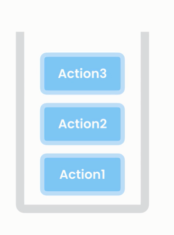

# 🧱 **Stacks (LIFO Data Structure)**

> A **Stack** is a **linear data structure** that follows the **Last In, First Out** (LIFO) rule:
> 🧃 _"The last element added is the first to come out."_
> Think of a **stack of plates** 🍽 — you add to the top, and remove from the top.

---

<div style="text-align: center">
    
</div>

---

## 📦 Where Is It Stored? (Memory)

- In C#, the `Stack<T>` class is a **reference type** stored on the **heap** 📦.
- The **variable reference** is on the **stack** if local to a method.
- Internally, it wraps a **dynamic array** and resizes when needed (amortized O(1) for push).

---

## 🧠 Real-World Analogy

- **Undo operations** (Ctrl+Z)
- **Back/Forward navigation**
- **Function call stack** (each method call is pushed, returned = pop)
- **Syntax parsing** and **expression evaluation**

> ✅ Whenever you need to **reverse an action**, **match brackets**, or **track order**, think: Stack!

---

## 🧪 Core Operations

| Operation     | Description                           | Time Complexity |
| ------------- | ------------------------------------- | --------------- |
| `Push(x)`     | Add element to top                    | O(1)            |
| `Pop()`       | Remove and return top element         | O(1)            |
| `Peek()`      | View top element without removing     | O(1)            |
| `Count`       | Get number of elements                | O(1)            |
| `Contains(x)` | Check if value exists (not efficient) | O(n)            |

---

## 🛠 Stack Methods in Action

### ✅ `Push` & `Pop` Example – Reverse a String

```csharp
public static string Reverse(string input)
{
    var stack = new Stack<char>();
    foreach (char ch in input)
        stack.Push(ch);  // LIFO push

    var reversed = new char[input.Length];
    int i = 0;
    while (stack.Count > 0)
        reversed[i++] = stack.Pop();  // LIFO pop

    return new string(reversed);
}
```

---

### ✅ `Push`, `Pop`, and `Peek` — Balanced Parentheses

#### 🔹 Version 1: Only `(` and `)`

```csharp
public static bool IsBalancedV1(string input)
{
    var stack = new Stack<char>();
    foreach (char ch in input)
    {
        if (ch == '(') stack.Push(ch);
        if (ch == ')')
        {
            if (stack.Count == 0) return false;
            stack.Pop();
        }
    }
    return stack.Count == 0;
}
```

---

#### 🔹 Version 2: All types of brackets

```csharp
public static bool IsBalancedV2(string input)
{
    var stack = new Stack<char>();
    foreach (char ch in input)
    {
        switch (ch)
        {
            case '(':
            case '[':
            case '{':
            case '<':
                stack.Push(ch);
                break;
            case ')':
            case ']':
            case '}':
            case '>':
                if (stack.Count == 0 || !IsMatch(stack.Pop(), ch))
                    return false;
                break;
        }
    }
    return stack.Count == 0;
}

private static bool IsMatch(char open, char close)
{
    return (open == '(' && close == ')') ||
           (open == '[' && close == ']') ||
           (open == '{' && close == '}') ||
           (open == '<' && close == '>');
}
```

---

## 🔍 Why O(1) Time for Stack Operations?

The internal array tracks the **"top index"**. When you `Push`, it just:

- Assigns the value to `array[top++]` ✅
  When you `Pop`, it simply:
- Returns `array[--top]` ✅

📌 No shifting, no searching → **constant time**.

---

## 🚀 Common Use Cases

| Use Case                  | Why Stack? (LIFO)              |
| ------------------------- | ------------------------------ |
| Undo operations           | Last action undone first       |
| Backtracking (e.g., Maze) | Explore last tried path first  |
| Expression evaluation     | Postfix/Infix conversion       |
| Compiler syntax checking  | Match opening/closing brackets |
| DFS traversal             | Depth-first via stack          |
| Browser back/forward      | Push on visit, pop on back     |

---

## 🧱 Custom Stack Implementation (Singly Linked)

```csharp
public class HwStack<T>
{
    private class Node
    {
        public T Value;
        public Node Next;
        public Node(T value) => Value = value;
    }

    private Node _top;
    private int _count;

    public void Push(T item)
    {
        var node = new Node(item);
        node.Next = _top;
        _top = node;
        _count++;
    }

    public T Pop()
    {
        if (_top == null) throw new InvalidOperationException("Stack is empty");
        var value = _top.Value;
        _top = _top.Next;
        _count--;
        return value;
    }

    public T Peek() => _top == null ? throw new InvalidOperationException() : _top.Value;

    public int Count => _count;
}
```

---

## ⚖️ Stack vs Queue vs Array

| Feature      | Stack              | Queue           | Array                |
| ------------ | ------------------ | --------------- | -------------------- |
| Access Order | LIFO               | FIFO            | Random Access        |
| Access Time  | O(1) top           | O(1) front      | O(1) by index        |
| Insert Time  | O(1)               | O(1)            | O(n) (insert middle) |
| Remove Time  | O(1)               | O(1)            | O(n) (shift left)    |
| Use Case     | Undo, Backtracking | Queues, Buffers | Indexable Storage    |

---

## ✅ Summary

| Operation | Description            | Time Complexity |
| --------- | ---------------------- | --------------- |
| Push      | Add to top             | O(1)            |
| Pop       | Remove from top        | O(1)            |
| Peek      | View top item          | O(1)            |
| Count     | Get number of elements | O(1)            |
| Contains  | Check if value exists  | O(n)            |

---

## 📌 Final Notes

- Stack is internally backed by an **array** in C# and **grows dynamically**.
- Ideal for scenarios with **reversal, backtracking, or nested structures**.
- You can implement it using:

  - Arrays (dynamic resizing needed)
  - Linked lists (pointer-based, no resizing)
