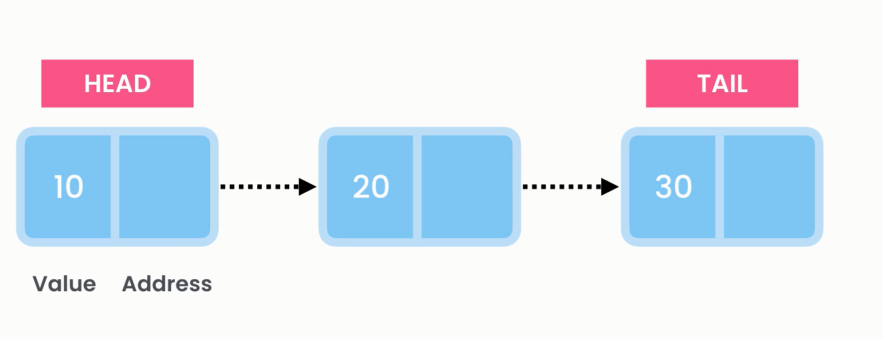
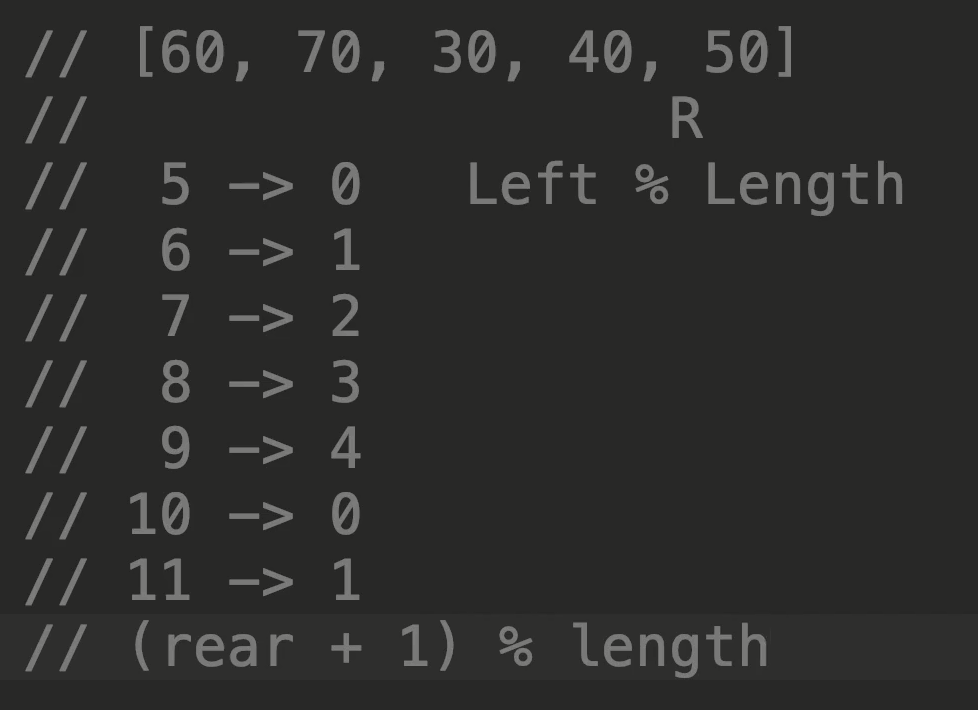

# Queue Data Structure



## Overview

- A **queue** is a data structure that follows the First In, First Out (FIFO) principle. This means that the first element added to the queue is the first one to be removed.
- Think of a queue as a line of people waiting for a bus. The first person to arrive is the first to board the bus, and as more people join the line, they join at the back.

## Key Operations

1. **Enqueue:** `O(1)`

   - Adds an element to the back (rear) of the queue.

2. **Dequeue:** `O(1)`

   - Removes and returns the element from the front (front) of the queue.

3. **Peek (or Front):** `O(1)`

   - Returns the element at the front of the queue without removing it.

4. **IsEmpty** `O(1)`

   - check if the stack is empty or not.

5. **IsFull** `O(1)`
   - check if the stack is full or not.

## Characteristics

- **Ordering:**

  - Elements are added at the back and removed from the front, maintaining a strict order.

- **Usage:**

  - Suitable for scenarios where elements are processed in the order they arrive, such as task scheduling or print job queues.

- **Implementation:**

  - Can be implemented using arrays, linked lists, or other dynamic structures.

- **Applications:**
  - Task scheduling, print job queues, breadth-first search algorithms, and more.

## Example

```csharp
using System;
using System.Collections.Generic;

class Program
{
    static void Main()
    {
        Queue<int> queue = new Queue<int>();

        queue.Enqueue(10);
        queue.Enqueue(20);
        queue.Enqueue(30);

        int frontElement = queue.Dequeue(); // Returns 10
        int newFrontElement = queue.Peek(); // Returns 20

        Console.WriteLine("Front Element after Dequeue: " + frontElement);
        Console.WriteLine("Front Element after Peek: " + newFrontElement);
    }
}
```

```cs
public static Queue<T> Reverse(Queue<T> queue)
{
    var stack = new Stack<T>();
    while (queue.Count > 0)
        stack.Push(queue.Dequeue());
    while (stack.Count > 0)
        queue.Enqueue(stack.Pop());
    return queue;
}
```

## Custom Implementation of Queue

### using Arrays with Circular Array



A circular array (also known as a circular buffer or ring buffer) is a data structure that uses a single, fixed-size array as if it were connected end-to-end. When the end of the array is reached, it wraps around to the beginning, forming a circle. This allows for efficient use of memory and is particularly useful in scenarios where elements are continuously added and removed.

### using Stacks

## Priority Queue
