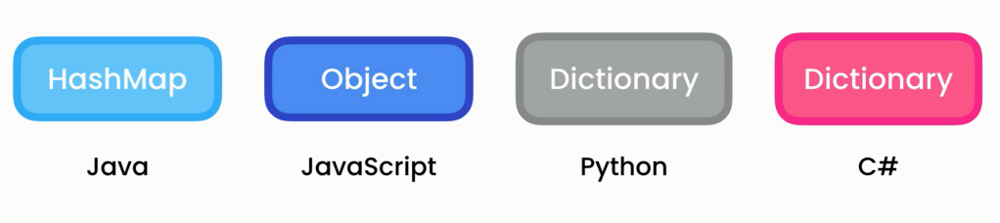
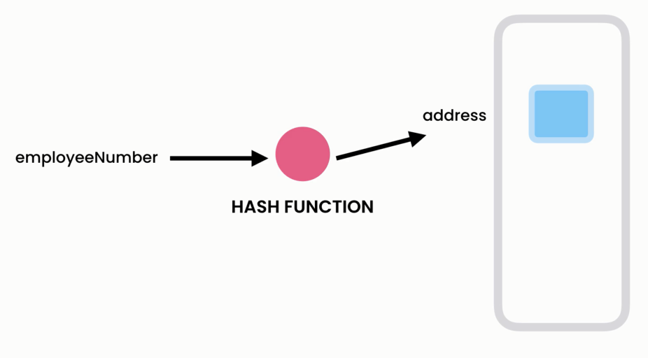
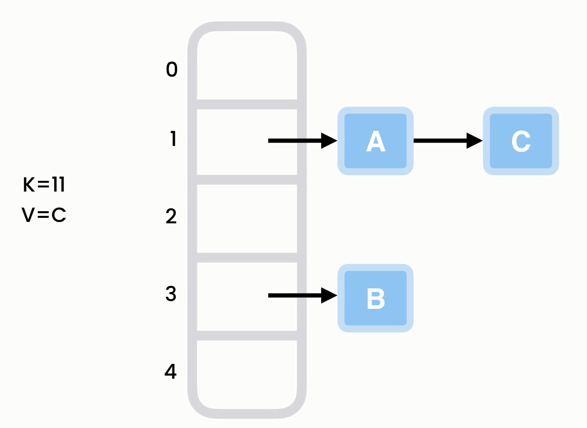

# 🧠 **HashTable in C#** – The Brain Behind Fast Lookup

> A **hashtable** is a blazing-fast data structure used to store key-value pairs for **constant-time lookups** in most cases.

---

<div style="text-align: center">
    
</div>
<div style="text-align: center">
    
</div>

---

## 📖 Definition

- A **Hashtable** (or **Dictionary** in C#) stores **key-value pairs** and retrieves values using a **hash of the key**.
- It uses an **array internally** and maps keys to indices using a **hash function**.
- It handles **collisions** using chaining or open addressing techniques.

---

## 💡 Real-World Analogy

> Think of a hashtable like a **mailroom with lockers**.
> Each key (mail label) is converted into a locker number (index).
> If two letters map to the same locker — that’s a **collision** 📬📬 → need a strategy to resolve it!

---

## 🧬 Characteristics

| Feature                   | Description                                                                 |
| ------------------------- | --------------------------------------------------------------------------- |
| 🔑 **Key-Value Pair**     | Each item is stored with a unique key                                       |
| 🔗 **Hash Function**      | Maps keys to index in underlying array                                      |
| ⚠️ **Collision Handling** | Uses **chaining** (linked list) or **open addressing** to resolve conflicts |
| 🚀 **Fast Lookup**        | Average case access, insert, delete in **O(1)**                             |

---

## ⏱ Time Complexity

| Operation | Average Time | Worst Time  |
| --------- | ------------ | ----------- |
| Insertion | O(1)         | O(n) (rare) |
| Lookup    | O(1)         | O(n)        |
| Deletion  | O(1)         | O(n)        |

✅ Average case assumes: good hash function, low collisions, proper load factor.

---

## 🛠 Hashtable Operations in C\

### 1️⃣ Index Notation (`[]`) – Add / Get / Update

```csharp
var dict = new Dictionary<string, string>();
dict["color"] = "blue";             // Add
dict["color"] = "green";            // Update
var value = dict["color"];          // Get
```

📌 Throws `KeyNotFoundException` if key doesn't exist when getting.

---

### 2️⃣ `Add()` – Throws on duplicate

```csharp
dict.Add("key", "value");
```

- ❌ Throws `ArgumentException` if key exists

---

### 3️⃣ `TryAdd()` – Safe Add (no exception)

```csharp
dict.TryAdd("key", "value"); // Returns false if key exists
```

---

### 4️⃣ `TryGetValue()` – Safe Get

```csharp
if (dict.TryGetValue("key", out var value))
    Console.WriteLine(value);
else
    Console.WriteLine("Not Found");
```

---

### 5️⃣ `Remove(key)`

```csharp
dict.Remove("key");
```

---

### 6️⃣ `ContainsKey()` / `ContainsValue()`

```csharp
dict.ContainsKey("username");     // O(1)
dict.ContainsValue("admin");      // O(n)
```

---

### 7️⃣ `Keys` / `Values`

```csharp
var keys = dict.Keys;
var values = dict.Values;
```

---

## 🧪 Examples

### 🔠 Find First Non-Repeating Character

```csharp
public static char FindFirstNonRepeatingChar(string str)
{
    var dict = new Dictionary<char, int>();

    foreach (var ch in str)
        dict[ch] = dict.ContainsKey(ch) ? dict[ch] + 1 : 1;

    foreach (var ch in str)
        if (dict[ch] == 1) return ch;

    return char.MinValue;
}
```

---

### 🚫 Remove Duplicates from Array

```csharp
public static int[] RemoveDuplication(int[] arr)
{
    return new HashSet<int>(arr).ToArray();
}
```

---

### 🔁 Find First Repeating Character

```csharp
public static char FindFirstRepeatingChar(string str)
{
    var seen = new HashSet<char>();

    foreach (var ch in str)
    {
        if (seen.Contains(ch)) return ch;
        seen.Add(ch);
    }

    return char.MinValue;
}
```

---

## ⚙️ How Hashtable Internally Works

1. **Hash Function** maps key → integer → index
2. **Array** is the base structure to store entries
3. **Collision Resolution** is needed when multiple keys map to the same index

---

## 🔢 Hash Function – Simple Example

```csharp
public static int GetHashCode(string key)
{
    int hash = 0;
    foreach (var ch in key)
        hash += ch;

    return hash % 100;
}
```

> Maps strings like `"cat"` or `"bat"` into array index `0-99`

---

## 💥 Collision Handling

<div style="text-align: center">
    
</div>

---

### 🤯 What is a Collision?

- Two **different keys** map to the **same index**.
- E.g., `"abc"` and `"acb"` → both return `index 5` → now what?

---

## 🛠 Collision Resolution Strategies

### ✅ Chaining (Recommended)

<div style="text-align: center">
    
</div>

---

- Store multiple entries in a **linked list** at the same index
- Easy to implement, scales well
- Used in **.NET Dictionary**

---

### ❌ Open Addressing (Probing)

- Try other indices if desired one is full

#### 🔍 Types

- Linear Probing → next slot (i+1, i+2…)
- Quadratic Probing → skip in steps
- Double Hashing → another hash for step size

---

## 🏗 Custom Hashtable Implementation?

We can implement our own with:

- Array of linked lists
- Manual hashing
- `Add()`, `Get()`, `Remove()` methods

📌 Let me know if you want a **full custom implementation**!

---

## ✅ Summary Table

| Feature        | Hashtable (Dictionary)  |
| -------------- | ----------------------- |
| Key Lookup     | ✅ Fast (O(1) average)  |
| Order          | ❌ Not guaranteed       |
| Null Keys      | ✅ One (string only)    |
| Collision      | ✅ Handled via chaining |
| Key Uniqueness | ✅ Required             |
| Resizable      | ✅ Dynamically grows    |

---

## ✅ Use Cases

- **Indexing** fast with keys (e.g., names, IDs)
- **Caching**, **memoization**, **configuration maps**
- Used heavily in **compilers**, **databases**, **language runtimes**
