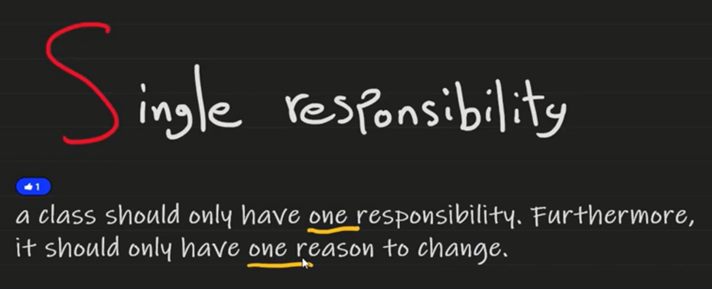
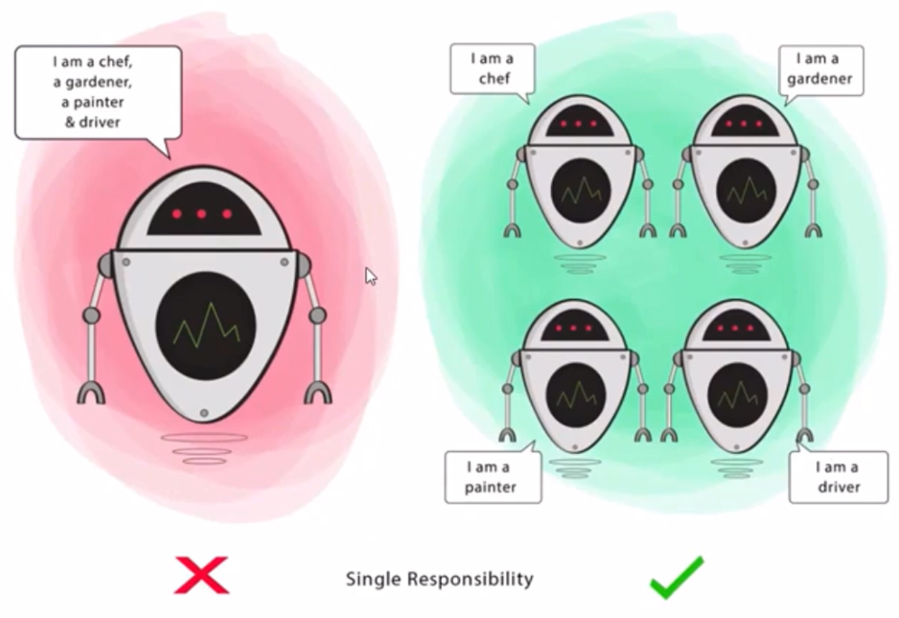

# 🧱 SOLID Principle #1 – **S: Single Responsibility Principle (SRP)**

> **"A class should have only one reason to change."**

---

<div style="text-align: center;">
    
</div>

---

<div style="text-align: center;">
    
</div>

---

## 🧠 What Is SRP?

> A class should **do one thing and do it well**. It should only have **one responsibility**, or in simpler terms, it should **focus on a single job**.

If a class has more than one reason to change, it has more than one responsibility — and that's a design smell 🚨

---

## ❌ Anti-Example (Violates SRP)

```csharp
public class ReportManager
{
    public void GenerateReport() { /* logic */ }

    public void SaveToDatabase() { /* DB logic */ }

    public void SendEmail() { /* Email logic */ }
}
```

### ❗What's wrong?

- **Generating**, **saving**, and **sending** are **3 responsibilities**
- This class could break for multiple unrelated reasons:

  - Email logic changes ☠️
  - Database schema changes ☠️
  - Report format changes ☠️

---

## ✅ Refactored (Follows SRP)

```csharp
public class ReportGenerator
{
    public Report Generate() { /* logic */ }
}

public class ReportSaver
{
    public void Save(Report report) { /* DB logic */ }
}

public class EmailSender
{
    public void Send(Report report) { /* Email logic */ }
}
```

✅ Each class has **one clear reason to change**
✅ Easier to maintain, test, and extend independently

---

## 📦 SRP in Real Life

| Violation Example                                | Why It’s Bad                            |
| ------------------------------------------------ | --------------------------------------- |
| `UserService` that handles login + DB ops + logs | Mixes too many concerns                 |
| `InvoiceManager` that sends emails + saves files | Can’t modify one without risking others |
| `Controller` that does business logic            | Violates MVC separation of concerns     |

---

## 🧪 Benefits of SRP

| Benefit                 | Why It Matters                           |
| ----------------------- | ---------------------------------------- |
| 🔬 Easier to test       | Each class has a small, testable job     |
| 🧠 Easier to understand | Classes are short and focused            |
| 🛠 Easier to change      | Modifying one job doesn’t break the rest |
| 🧩 Reusable             | Small components are reusable elsewhere  |

---

## 💬 Interview Insight

> "SRP makes your code clean, modular, and scalable. The more a class does, the harder it is to maintain. Think of responsibilities like ‘axes of change’ — if a class changes for two unrelated reasons, it violates SRP."

---

## ✅ Summary

| Principle | Single Responsibility Principle (SRP)          |
| --------- | ---------------------------------------------- |
| Core Idea | One class = One job                            |
| Goal      | Reduce complexity and increase maintainability |
| Watch for | Classes doing UI, business, and persistence    |

---

## 🧠 Real-World Analogy

| Class             | Real-World Equivalent                             |
| ----------------- | ------------------------------------------------- |
| `ReportManager`   | A person who cooks, serves, and fixes plumbing 😰 |
| SRP-based classes | A chef, a waiter, and a plumber 👨‍🍳🧑‍🍽️👨‍🔧         |
