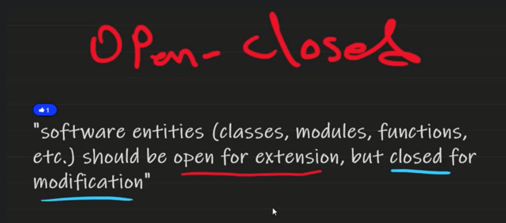
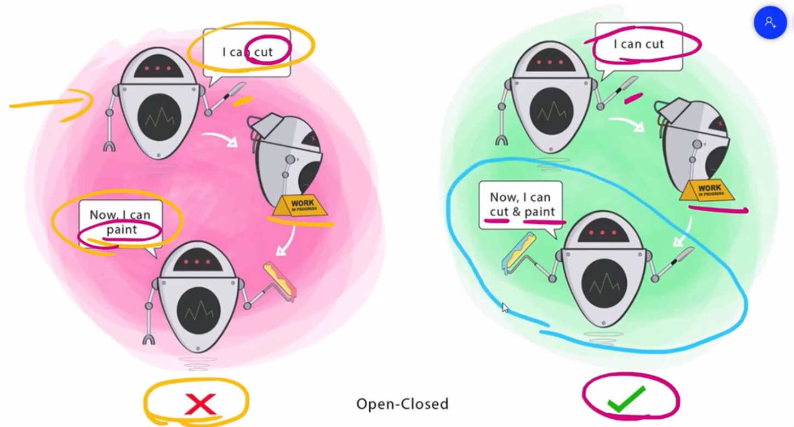

# 🧩 SOLID Principle #2 – **O: Open/Closed Principle (OCP)**

> **"Software entities should be open for extension but closed for modification."**

---

<div style="text-align: center;">
    
</div>

---

<div style="text-align: center;">
    
</div>

---

## 🧠 What Does That Mean?

- **Open for extension** → You can **add new behavior**
- **Closed for modification** → You **don’t change existing code**

> Add new features **without touching the old ones**
> This protects you from **breaking existing behavior** or introducing bugs 🪲

---

## ❌ Anti-Example (Violates OCP)

```csharp
public class InvoicePrinter
{
    public void Print(string type)
    {
        if (type == "PDF") Console.WriteLine("Printing PDF...");
        else if (type == "Excel") Console.WriteLine("Printing Excel...");
        else if (type == "HTML") Console.WriteLine("Printing HTML...");
    }
}
```

### ❗Problem

- Every new format (CSV, Word, etc.) forces you to **modify** this class
- This **breaks OCP** — code is not closed for modification

---

## ✅ Refactored (Follows OCP via Abstraction)

```csharp
public interface IInvoiceFormat
{
    void Print();
}

public class PdfInvoice : IInvoiceFormat
{
    public void Print() => Console.WriteLine("Printing PDF...");
}

public class ExcelInvoice : IInvoiceFormat
{
    public void Print() => Console.WriteLine("Printing Excel...");
}

public class HtmlInvoice : IInvoiceFormat
{
    public void Print() => Console.WriteLine("Printing HTML...");
}

public class InvoicePrinter
{
    public void PrintInvoice(IInvoiceFormat format)
    {
        format.Print();
    }
}
```

### ✅ Benefits

- Add new formats without touching `InvoicePrinter`
- Just create a **new class that implements `IInvoiceFormat`**

---

## 🧰 Common Tools to Achieve OCP

| Tool/Concept             | How It Helps                             |
| ------------------------ | ---------------------------------------- |
| Interfaces / Abstraction | Let you inject new behavior easily       |
| Strategy Pattern         | Choose behavior at runtime               |
| Inheritance (carefully)  | Add new logic via derived classes        |
| Dependency Injection     | Inject behavior instead of hardcoding it |

---

## 🧠 Real-World Analogy

| Concept           | Analogy                                                      |
| ----------------- | ------------------------------------------------------------ |
| Bad design        | A vending machine that must be rewired for each new snack 😵 |
| Good design (OCP) | A vending machine where you **plug in** new snack trays 🍫🧃 |

---

## 💬 Interview Insight

> "OCP helps make your code more maintainable. Instead of modifying core logic, you extend it using abstractions. This is especially useful in plugin-based systems or business-rule-heavy apps."

---

## ✅ Summary

| Concept    | Open/Closed Principle                      |
| ---------- | ------------------------------------------ |
| Open For   | Extension via new classes                  |
| Closed For | Modification of existing logic             |
| Main Tool  | Interfaces, abstract base classes          |
| Goal       | Add features without risk of breaking code |
