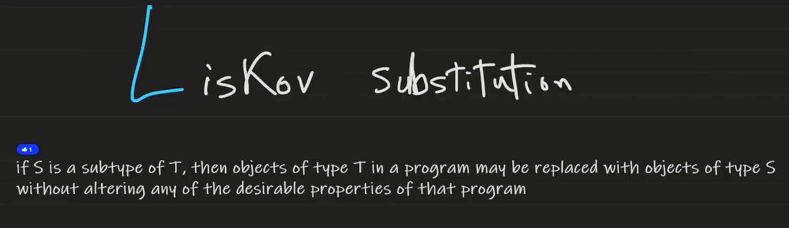
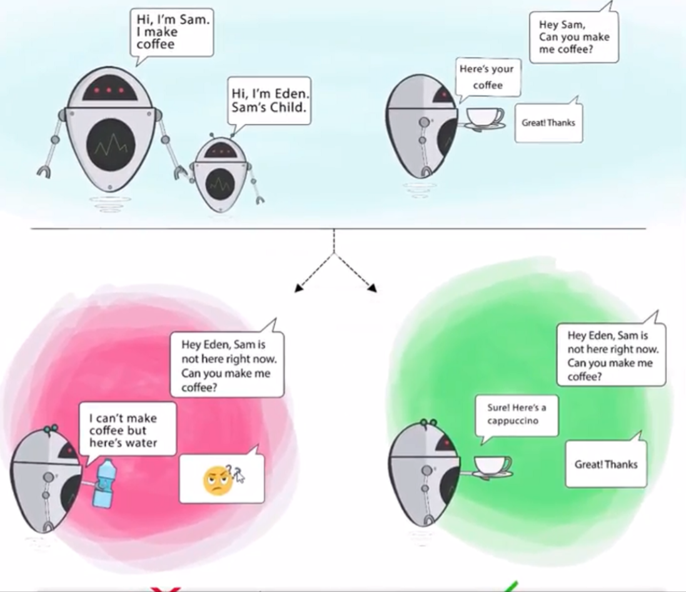

# 🔁 SOLID Principle #3 – **L: Liskov Substitution Principle (LSP)**

> **"Objects of a superclass should be replaceable with objects of a subclass without breaking the app."**

---

<div style="text-align: center;">
    
</div>

---

<div style="text-align: center;">
    
</div>

---

## 🧠 What Does That Mean?

> If you write code that uses a **base class**, it should **work correctly with any subclass** too — **without knowing** the difference.

✅ The derived class must **honor the contract** of the base
❌ It should **not throw unexpected exceptions** or **change expected behavior**

---

## ❌ Anti-Example (Violates LSP)

```csharp
public class Bird
{
    public virtual void Fly() => Console.WriteLine("Bird is flying");
}

public class Ostrich : Bird
{
    public override void Fly()
    {
        throw new NotImplementedException("Ostriches can't fly");
    }
}
```

### ❗Problem

- `Ostrich` **inherits** from `Bird`, but **can't fly**
- Using it in code that expects flying birds will break it 💥

---

## 🧪 Code That Breaks

```csharp
public void LetTheBirdFly(Bird bird)
{
    bird.Fly(); // 💥 Boom if bird is Ostrich!
}
```

> This violates LSP because the subclass **can't safely replace** the base class

---

## ✅ Refactored (Follows LSP)

### Split behaviors by capability

```csharp
public interface IFlyable
{
    void Fly();
}

public class Parrot : IFlyable
{
    public void Fly() => Console.WriteLine("Parrot flies");
}

public class Ostrich
{
    public void Run() => Console.WriteLine("Ostrich runs");
}
```

Now you don’t have broken substitution.
You only use `IFlyable` when flight is guaranteed 🛩️

---

## 📦 How to Ensure LSP

| Rule                                            | Explanation                                                      |
| ----------------------------------------------- | ---------------------------------------------------------------- |
| No behavior contradiction                       | Don’t override base methods with different behavior              |
| No throwing exceptions for allowed base actions | Don’t remove functionality in subclass                           |
| Keep contracts and expectations                 | Return types, method meanings must stay the same                 |
| Avoid fake inheritance                          | If a subclass doesn’t truly "is-a" the base class, don’t inherit |

---

## 🔬 LSP in Real Life

| Violation Example                                            | Fix                                    |
| ------------------------------------------------------------ | -------------------------------------- |
| `Rectangle` subclass `Square` that breaks width/height logic | Separate them into different types     |
| `Bird` subclass `Ostrich` throws on `Fly()`                  | Use interfaces like `IFlyable` instead |
| Subclass disables base functionality                         | Use composition instead of inheritance |

---

## 💬 Interview Insight

> “LSP ensures that inheritance is safe and reliable. It’s violated when a subclass changes the expected behavior of its parent. If `Dog` is an `Animal`, it shouldn't break code that expects a general `Animal`.”

---

## ✅ Summary

| Principle    | Liskov Substitution Principle             |
| ------------ | ----------------------------------------- |
| Core Idea    | Subclasses must be usable as base classes |
| Danger Zone  | Unexpected exceptions, behavior changes   |
| Key Solution | Prefer interfaces, validate inheritance   |
| Benefits     | Predictable, flexible code reuse          |

---

## 🧠 Real-World Analogy

| Situation                       | Analogy                                       |
| ------------------------------- | --------------------------------------------- |
| `Bird` base, `Ostrich` subclass | Giving someone a plane ticket to a penguin ❌ |
| `IFlyable` for flying birds     | Only give tickets to birds that can fly ✅    |
