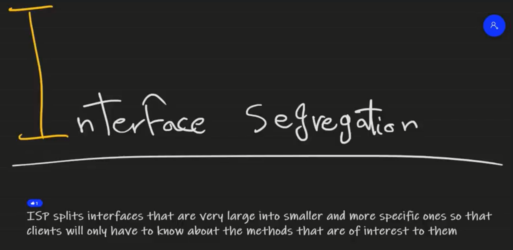
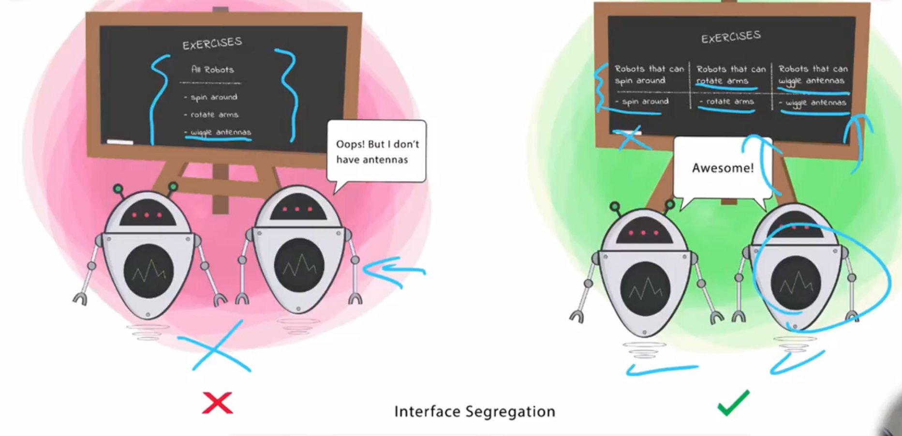

# 🔌 SOLID Principle #4 – **I: Interface Segregation Principle (ISP)**

> **“Clients should not be forced to depend on methods they do not use.”**

---

<div style="text-align: center;">
    
</div>

---

<div style="text-align: center;">
    
</div>

---

## 🧠 What Does That Mean?

> An interface should have **only the methods that are relevant to the implementing class**.
> If a class is forced to implement **unused or meaningless methods**, the interface is too fat.

---

## ❌ Anti-Example: Fat Interface

```csharp
public interface IMultiFunctionDevice
{
    void Print();
    void Scan();
    void Fax(); // 👀 Who still faxes?
}

public class ModernPrinter : IMultiFunctionDevice
{
    public void Print() { /* ✅ */ }
    public void Scan()  { /* ✅ */ }
    public void Fax()   { throw new NotSupportedException(); } // ❌
}
```

### ❗Problem

- `ModernPrinter` is forced to implement **Fax()** even if it doesn't support it
- This leads to:

  - Exception-throwing methods
  - Useless code
  - Violated ISP

---

## ✅ Refactored: Split Interfaces

```csharp
public interface IPrinter
{
    void Print();
}

public interface IScanner
{
    void Scan();
}

public interface IFax
{
    void Fax();
}

public class ModernPrinter : IPrinter, IScanner
{
    public void Print() { /* ✅ */ }
    public void Scan()  { /* ✅ */ }
}
```

✅ Now classes **only implement what they need**
✅ Smaller interfaces = more flexibility and separation of concerns

---

## 🔬 Real-World Signs of ISP Violation

| Symptom                                                | Likely Violation           |
| ------------------------------------------------------ | -------------------------- |
| Interfaces with 5+ unrelated methods                   | Too many responsibilities  |
| Implementing classes throw `NotImplementedException()` | Not all methods are needed |
| Client code ignores half the interface                 | Interface is too broad     |

---

## 🔧 Tools & Practices

| Strategy                     | Benefit                           |
| ---------------------------- | --------------------------------- |
| Break large interfaces       | Smaller, focused abstractions     |
| Use multiple interfaces      | Combine only what's needed        |
| Composition over inheritance | Build behavior modularly          |
| Marker interfaces            | When logic-less tagging is needed |

---

## 💬 Interview Insight

> "The Interface Segregation Principle keeps systems modular. When interfaces grow too large, they reduce reusability and lead to brittle implementations. Clean interfaces reflect clean architecture."

---

## ✅ Summary

| Principle      | Interface Segregation Principle (ISP)                 |
| -------------- | ----------------------------------------------------- |
| Core Idea      | No class should be forced to implement unused methods |
| Smell to Watch | Large interfaces, irrelevant method contracts         |
| Fix            | Split interfaces, use multiple smaller ones           |
| Goal           | Modular, flexible, intention-revealing code           |

---

## 🧠 Real-World Analogy

| Concept               | Analogy                                             |
| --------------------- | --------------------------------------------------- |
| Fat interface         | A Swiss Army knife where 90% of tools you never use |
| Segregated interfaces | Only carrying the exact tool you need 🛠️            |
