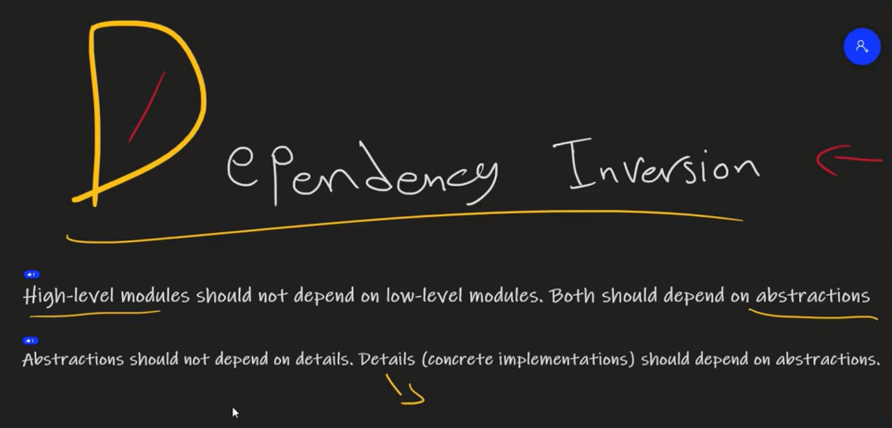
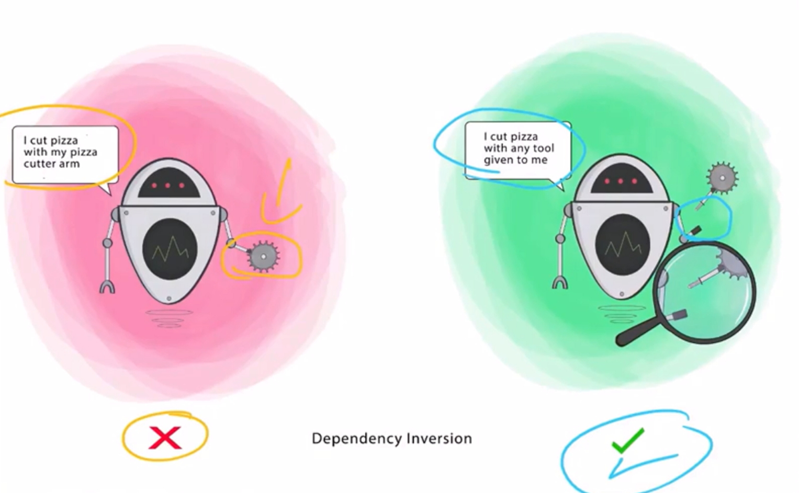

# 🏗️ SOLID Principle #5 – **D: Dependency Inversion Principle (DIP)**

> **“High-level modules should not depend on low-level modules. Both should depend on abstractions.”**

---

<div style="text-align: center;">
    
</div>

---

<div style="text-align: center;">
    
</div>

---

## 🧠 What Does That Really Mean?

DIP flips traditional dependency direction:

- Instead of high-level logic (business code) calling directly into low-level details (DB, file system, API),
- Both depend on **abstractions** (interfaces)

> ✅ Code becomes **loosely coupled**, **easier to maintain**, and **unit-test friendly**

---

## ❌ Anti-Example (Tight Coupling)

```csharp
public class ReportService
{
    private readonly SqlReportRepository _repository = new();

    public void GenerateReport()
    {
        var report = _repository.GetReport(); // Direct dependency
        Console.WriteLine(report);
    }
}
```

### ❗What's wrong?

- `ReportService` is tightly coupled to `SqlReportRepository`
- Can’t switch to file-based or mock storage easily
- Violates DIP: high-level module depends on low-level details

---

## ✅ Refactored with DIP

### Step 1: Define an abstraction

```csharp
public interface IReportRepository
{
    string GetReport();
}
```

### Step 2: Implement the interface

```csharp
public class SqlReportRepository : IReportRepository
{
    public string GetReport() => "Report from SQL DB";
}
```

### Step 3: Depend on the abstraction

```csharp
public class ReportService
{
    private readonly IReportRepository _repository;

    public ReportService(IReportRepository repository)
    {
        _repository = repository;
    }

    public void GenerateReport()
    {
        Console.WriteLine(_repository.GetReport());
    }
}
```

✅ `ReportService` can now work with **any kind of repo**
✅ Switch to mock repo in tests
✅ Follows DIP perfectly

---

## 🧰 DIP in Practice (Framework-Level)

| Feature/Tool                  | How It Supports DIP                                 |
| ----------------------------- | --------------------------------------------------- |
| **Dependency Injection (DI)** | Constructor injection enforces abstraction          |
| **Interfaces & Abstractions** | Breaks concrete dependencies                        |
| **IoC Containers**            | Automates dependency resolution (like in .NET Core) |

---

## 💬 Interview Insight

> "DIP ensures high-level code stays reusable and clean. When you inject interfaces instead of hardcoding dependencies, you make code testable and extensible. It’s the foundation of DI and clean architecture."

---

## ✅ Summary

| Concept  | Dependency Inversion Principle (DIP)     |
| -------- | ---------------------------------------- |
| Goal     | Decouple high-level and low-level logic  |
| How      | Depend on abstractions (interfaces)      |
| Tools    | Interfaces, DI, IoC containers           |
| Benefits | Testability, flexibility, loose coupling |
