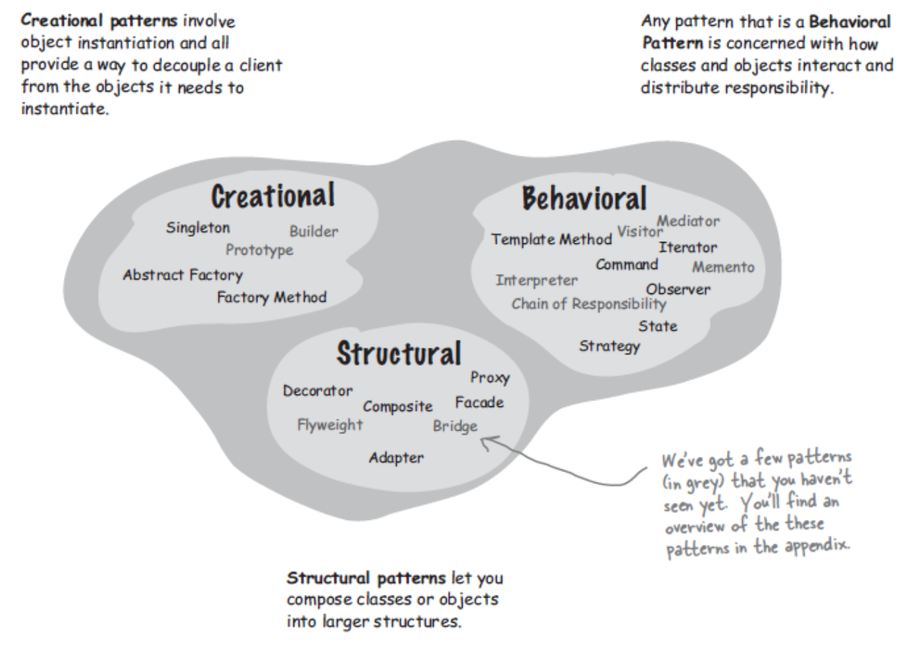

# 🧠 **Introduction to Design Patterns in C#**

> Design Patterns are **battle-tested solutions** to common software problems — a developer’s architectural toolkit 🧰

---

    

---

> Core Design Patterns are => 4 for **frontend** (`Decorator`, `Command`, `Momento`, `Observer`) and 4 for **backend** (`Singleton`, `Iterator`, `Builder`, `Mediator`)

---

## 💡 What Are Design Patterns?

> A **design pattern** is a **reusable, general solution** to a commonly occurring problem in software design.
> It’s not code — it’s a **template** you can apply to real scenarios.

✅ Patterns:

- Solve **specific design problems**
- Use **object-oriented concepts**
- Improve code **flexibility**, **scalability**, and **maintainability**

---

## 🎯 Why Use Design Patterns?

| Benefit 🟢                  | Why It Matters 🧠                         |
| --------------------------- | ----------------------------------------- |
| Reusability                 | Don't reinvent the wheel 🚘               |
| Standardized language       | “Let’s use a Singleton” = clear to all 🗣️ |
| Proven solutions            | Time-tested and community-validated 💯    |
| Maintainability             | Easier to refactor and extend 🔧          |
| Flexibility via Abstraction | Promotes loosely-coupled architecture 🔌  |

---

## 🧩 Pattern vs Principle vs Architecture

| Concept          | What It Does                                     |
| ---------------- | ------------------------------------------------ |
| **Principle**    | General rule for writing good code (e.g., SOLID) |
| **Pattern**      | Concrete solution template for common problem    |
| **Architecture** | System-wide structure and high-level decisions   |

---

## 📦 Design Pattern Classifications

Design Patterns are grouped by **intent**.
Let’s break them into the **classic 3 categories** from the GoF book (Gang of Four):

---

### 🏗️ 1. **Creational Patterns**

> Concerned with **object creation** logic
> Help make code **independent of how objects are created**

| Pattern Name         | Use Case                                       |
| -------------------- | ---------------------------------------------- |
| **Singleton**        | Only one instance ever (e.g., Logger)          |
| **Factory Method**   | Defer object creation to subclasses            |
| **Abstract Factory** | Create families of related objects             |
| **Builder**          | Step-by-step construction of complex objects   |
| **Prototype**        | Clone existing objects instead of building new |

---

### 🧱 2. **Structural Patterns**

> Concerned with **object composition and relationships**
> Help ensure that pieces fit together cleanly

| Pattern Name  | Use Case                                          |
| ------------- | ------------------------------------------------- |
| **Adapter**   | Convert one interface to another                  |
| **Bridge**    | Decouple abstraction from implementation          |
| **Composite** | Treat groups of objects as one (tree structures)  |
| **Decorator** | Add behavior without changing original class      |
| **Facade**    | Provide a simplified interface over complex logic |
| **Flyweight** | Minimize memory by sharing similar objects        |
| **Proxy**     | Stand-in for real object to control access        |

---

### 🤝 3. **Behavioral Patterns**

> Concerned with **communication between objects**
> Help with **control flow** and object interaction

| Pattern Name                | Use Case                                         |
| --------------------------- | ------------------------------------------------ |
| **Strategy**                | Select behavior at runtime (e.g., sorting logic) |
| **Observer**                | Notify many objects of state changes             |
| **Command**                 | Encapsulate requests as objects                  |
| **Chain of Responsibility** | Pass request along chain until handled           |
| **Template Method**         | Define algorithm skeleton, allow steps override  |
| **State**                   | Change object behavior based on internal state   |
| **Mediator**                | Centralized communication between components     |
| **Memento**                 | Capture and restore object state (undo)          |
| **Visitor**                 | Add operations to classes without modifying them |
| **Iterator**                | Sequentially access elements of a collection     |
| **Interpreter**             | Evaluate language grammar or expression trees    |

---

## 🧠 Real-World Analogy

| Classification | Analogy 🧠                                      |
| -------------- | ----------------------------------------------- |
| **Creational** | Choosing **how** to create a car 🚗             |
| **Structural** | How parts of the car **fit together** 🧱        |
| **Behavioral** | How the car **interacts with the driver** 🧑‍✈️ |
