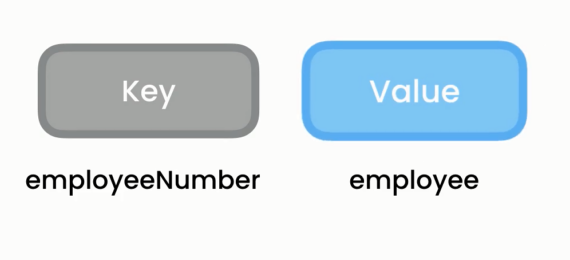
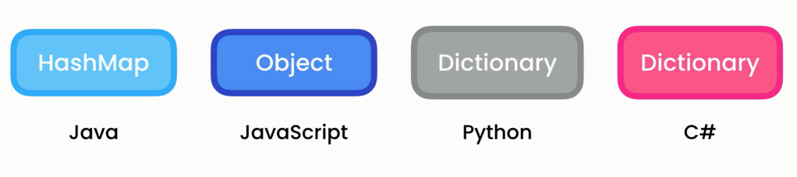
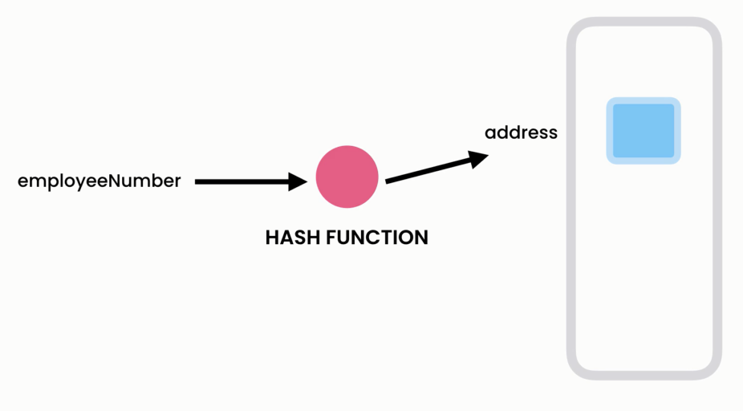
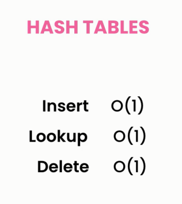

# Hashtable in C






## Definition

A hashtable is a data structure that allows efficient storage and retrieval of values using a key. It is particularly well-suited for situations where fast access to data is crucial.

## Characteristics

- **Key-Value Pair:** Each entry in a hashtable consists of a key-value pair.
- **Hash Function:** A hash function is employed to map keys to indices in the underlying array.
- **Collision Handling:** Collisions occur when two keys hash to the same index. Hashtables use strategies like chaining or open addressing to manage collisions.
- **Efficient Lookup:** Retrieving a value based on its key has an average time complexity of `O(1)`.

## Usage

- spell checkers
- dictionaries
- compilers
- code editors

## Time Complexity

- **Insertion**: O(1) average case, assuming a good hash function and minimal collisions.

- **Lookup**: O(1) average case for retrieval by key, but worst case is O(n) if there are many collisions.

- **Deletion**: O(1) average case, assuming a good hash function and minimal collisions.

## Operations

### 1. **Add**

- **Description:** Adds a key-value pair to the dictionary.
- **Time Complexity:** O(1) average case, O(n) worst case for collision resolution.

```csharp
myDictionary.Add("key", "value");
```

### 1. **Remove**

- **Description:** Removes the entry with the specified key from the dictionary.
- **Time Complexity:** `O(1)

```csharp
dictionary.Remove("key");
```

### 1. **TryGetValue(Key, out Value)**

- **Description:** Tries to get the value associated with the specified key.
- **Time Complexity:** `O(1)` average case

```csharp
dictionary.TryGetValue("key", out var value)
```

### 1. **ContainsKey(Key)**

- **Description:** Determines whether the dictionary contains the specified key.
- **Time Complexity:** O(1) average case,

```csharp
dictionary.ContainsKey("key")
```

### 1. **ContainsValue(Value)**

- **Description:** Determines whether the dictionary contains a specific value.
- **Time Complexity:** O(n) in the worst case as it may require iterating through values.

```csharp
dictionary.ContainsValue("value")
```

### 1. **Keys**

- **Description:** Gets a collection of all keys in the dictionary.
- **Time Complexity:** O(1)

```csharp
var keys = dictionary.Keys;
```

### 1. **Values**

- **Description:** Gets a collection of all Values in the dictionary.
- **Time Complexity:** O(1)

```csharp
var keys = dictionary.Values;
```

## Examples

