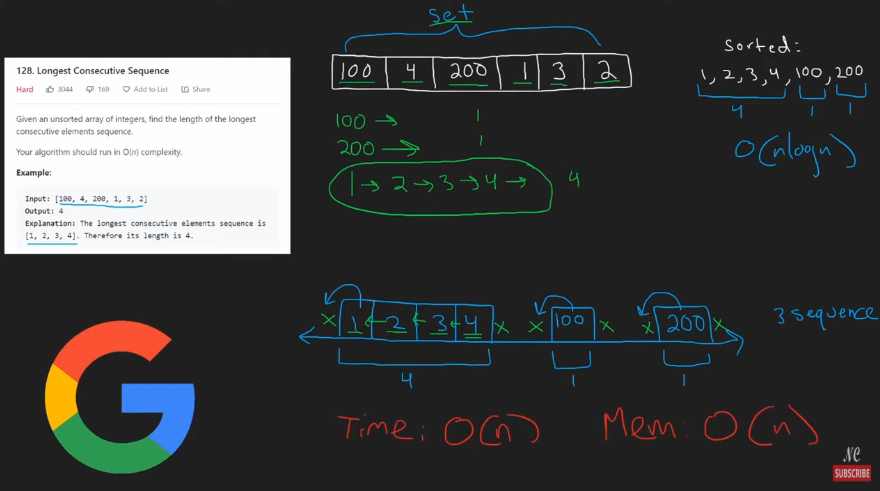
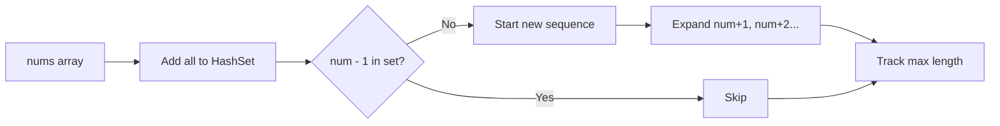

# 🔢 Problem Recap

📌 **Input**: Unsorted integer array
📌 **Goal**: Return the length of the **longest consecutive sequence**
📌 **Constraint**: Must run in **O(n)** time

---

<div style="text-align: center;">
    
</div>

---

## 🧠 High-Level Intuition

You want to find the **longest streak of consecutive numbers**, like:

```txt
Input: [100, 4, 200, 1, 3, 2]
Longest streak: 1 → 2 → 3 → 4
Output: 4
```

But you can’t sort (`O(n log n)`), so we need something faster — **HashSet to the rescue** 🦸‍♂️

---

## 🧮 Step-by-Step Breakdown from the Image

### 🔷 Step 1: Store All Numbers in a HashSet

```csharp
var set = new HashSet<int>(nums);
```

This gives **O(1)** lookup time for any number.

```txt
Set = { 100, 4, 200, 1, 3, 2 }
```

---

### 🔍 Step 2: Scan for the **Start of a Sequence**

Only begin counting a sequence if `num - 1` is **not in the set**.

In the image:

- `100 → 99 ❌ not found` → start sequence ✅
- `4 → 3 ✅ found` → skip ⛔
- `1 → 0 ❌ not found` → start sequence ✅
- `3 → 2 ✅ found` → skip ⛔
- `2 → 1 ✅ found` → skip ⛔
- `200 → 199 ❌ not found` → start sequence ✅

We start sequences only from the **leftmost end**.

---

### 📏 Step 3: Count Length of Consecutive Sequence

When starting from `1`, check:

- `2 → ✅`
- `3 → ✅`
- `4 → ✅`
- `5 → ❌`

So: `1 → 2 → 3 → 4` → Length = 4 ✅

---

### ✅ Final Result

- Sequence from `100`: length 1
- Sequence from `1`: length **4** 🥇
- Sequence from `200`: length 1

📤 Return **4**

---

## ⏱ Time & Space Analysis (Bottom of Image)

| Resource  | Complexity                              |
| --------- | --------------------------------------- |
| **Time**  | `O(n)` ✅ — Each number is visited once |
| **Space** | `O(n)` ✅ — For the HashSet             |

---

## 🧠 Why This Is Smart

- Doesn’t sort → avoids `O(n log n)`
- Doesn’t revisit elements unnecessarily
- HashSet lookup is O(1) — perfect for this type of problem

---

## 🎯 Visual Summary



---

## ✅ C# Code (Final, Clean Version)

```csharp
public class Solution {
    public int LongestConsecutive(int[] nums) {
        var set = new HashSet<int>(nums);
        int longest = 0;

        foreach (int num in nums) {
            if (!set.Contains(num - 1)) {
                int currentNum = num;
                int length = 1;

                while (set.Contains(currentNum + 1)) {
                    currentNum++;
                    length++;
                }

                longest = Math.Max(longest, length);
            }
        }

        return longest;
    }
}
```
