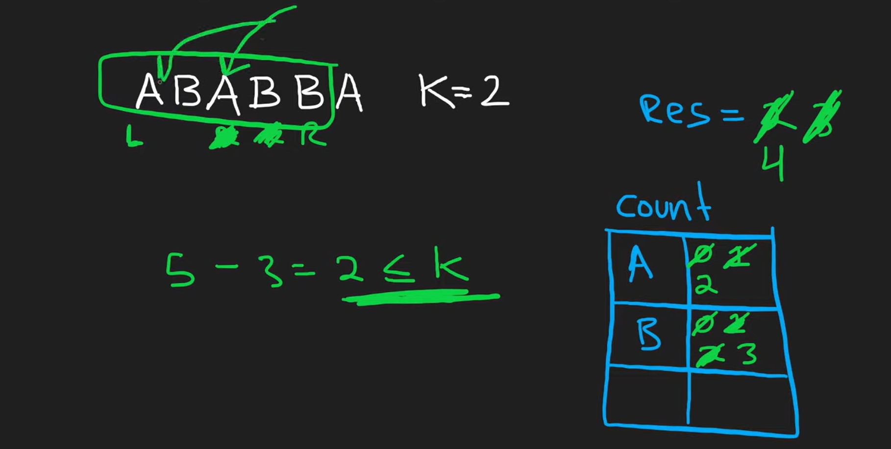

# 🧠 LeetCode 424: Longest Repeating Character Replacement

- 🔒 Difficulty: Medium
- 📚 Category: Sliding Window / Strings / HashMap
- 🎯 Pattern: **Sliding Window with Character Frequency Tracking**

---

## 📜 Problem Statement

You are given a string `s` and an integer `k`.
You can replace **at most `k` characters** in the string to make a **substring of all the same letter**.

> Return the **length** of the **longest possible substring** you can get this way.

---

## 📦 Example

```text
Input:  s = "AABABBA", k = 1
Output: 4
Explanation: Replace one 'B' with 'A' → "AAABBA" → "AAAB", length = 4
```

---

## ✅ Constraints

- `1 <= s.Length <= 10⁵`
- `s` contains only uppercase English letters (A–Z)
- `0 <= k <= s.Length`

---

## 🧠 Intuition

We want to find the longest window (substring) where **at most `k` characters need to be changed** to make all characters the same.

Instead of brute-forcing substrings, we use a **sliding window**, and within each window:

- Count the **most frequent character**
- See how many other characters need to be replaced

> As long as `window size - max frequency <= k`, the window is **valid**.

---

## 🔁 Sliding Window Strategy

- Track character frequencies using a dictionary.
- Keep track of the **most frequent character (`maxf`)** in the current window.
- If the number of **other** characters > `k`, slide the window.

---

<div style="text-align: center;">
    
</div>

---

## ✅ Optimal Solution in `C#`

```csharp
public int CharacterReplacement(string s, int k) {
    Dictionary<char, int> count = new Dictionary<char, int>();
    int res = 0;
    int l = 0, maxf = 0;

    for (int r = 0; r < s.Length; r++) {
        if (!count.ContainsKey(s[r]))
            count[s[r]] = 0;
        count[s[r]]++;

        maxf = Math.Max(maxf, count[s[r]]);

        // If the window is invalid, shrink it
        while ((r - l + 1) - maxf > k) {
            count[s[l]]--;
            l++;
        }

        // Update the result with the current window size
        res = Math.Max(res, r - l + 1);
    }

    return res;
}
```

---

## 🧪 Dry Run Example

```text
s = "AABABBA", k = 1

Step-by-step:
Window: A A B A → valid (maxF = 3, need to replace 1)
Window: A A B A B → invalid (need to replace 2) → shrink window
Window: A B A B → valid → res = 4
```

---

## 🧮 Time & Space Complexity

| Metric   | Value                               |
| -------- | ----------------------------------- |
| ⏱️ Time  | O(n)                                |
| 🧠 Space | O(1) (Max 26 letters in dictionary) |

---

## 🧠 Key Insight

> You **don't need to recalculate max frequency** when shrinking the window. Even if `maxf` is stale, it’s safe because **shrinking the window can never make it more valid**.

This is a classic trick to make the solution run in linear time.

---

## 🧵 Related Sliding Window Problems

| Problem                                                                                                                            | Pattern                            |
| ---------------------------------------------------------------------------------------------------------------------------------- | ---------------------------------- |
| [3. Longest Substring Without Repeating Characters](https://leetcode.com/problems/longest-substring-without-repeating-characters/) | Sliding Window + HashSet           |
| [1004. Max Consecutive Ones III](https://leetcode.com/problems/max-consecutive-ones-iii/)                                          | Sliding Window + At most K changes |
| [424. This one!](https://leetcode.com/problems/longest-repeating-character-replacement/)                                           | Sliding Window + Char Frequency    |

---

## 🧩 Memorize This Pattern

```csharp
Dictionary<char, int> count = new();
int l = 0, maxf = 0;

for (int r = 0; r < s.Length; r++) {
    count[s[r]]++;
    maxf = Math.Max(maxf, count[s[r]]);

    if ((r - l + 1) - maxf > k)
        count[s[l++]]--;

    res = Math.Max(res, r - l + 1);
}
```
